# Jotform MCP Pulse — Mimari, Veri Akışı ve Kod Rehberi

> **Belgenin amacı:** Bu dosya, `jotform-observability-dashboard` uygulamasını kaynak kodu açmadan anlayabilmek; kaynak kod açıldığında da hangi davranışın nerede bulunduğunu hızla bulabilmek için hazırlanmış yaşayan mimari el kitabıdır.
>
> **Kod anlık görüntüsü:** 14 Ağustos 2026 tarihindeki workspace içeriği.
>
> **Kapsam:** Ekranlar, Django view’ları, ORM sorguları, metrik formülleri, veri modeli, JSONL ingestion, correlation, rule engine, Celery/Docker çalışma modeli, API’ler, frontend yapısı, testler ve repository’deki her dosyanın sorumluluğu.

---

## İçindekiler

1. [Bir dakikalık sistem özeti](#1-bir-dakikalık-sistem-özeti)
2. [Sistem sınırı ve temel kararlar](#2-sistem-sınırı-ve-temel-kararlar)
3. [Katmanlı mimari](#3-katmanlı-mimari)
4. [Runtime ve deployment topolojisi](#4-runtime-ve-deployment-topolojisi)
5. [Domain terminolojisi ve trace hiyerarşisi](#5-domain-terminolojisi-ve-trace-hiyerarşisi)
6. [Veri kaynakları](#6-veri-kaynakları)
7. [Ingestion akışı](#7-ingestion-akışı)
8. [Adapter ve normalization davranışları](#8-adapter-ve-normalization-davranışları)
9. [Correlation mimarisi](#9-correlation-mimarisi)
10. [Veritabanı modeli](#10-veritabanı-modeli)
11. [Rule engine ve bulgu üretimi](#11-rule-engine-ve-bulgu-üretimi)
12. [Metrikler ve bütün formüller](#12-metrikler-ve-bütün-formüller)
13. [URL, ekran, view, template ve veri kaynağı haritası](#13-url-ekran-view-template-ve-veri-kaynağı-haritası)
14. [Ekranların ayrıntılı çalışma şekli](#14-ekranların-ayrıntılı-çalışma-şekli)
15. [Sunum ve frontend mimarisi](#15-sunum-ve-frontend-mimarisi)
16. [JSON API](#16-json-api)
17. [Docker, Celery ve başlangıç akışları](#17-docker-celery-ve-başlangıç-akışları)
18. [Konfigürasyon ve environment değişkenleri](#18-konfigürasyon-ve-environment-değişkenleri)
19. [Güvenlik, gizlilik ve veri sınırları](#19-güvenlik-gizlilik-ve-veri-sınırları)
20. [Hata senaryoları ve operasyon rehberi](#20-hata-senaryoları-ve-operasyon-rehberi)
21. [Performans karakteristiği ve bilinen sınırlar](#21-performans-karakteristiği-ve-bilinen-sınırlar)
22. [Test mimarisi](#22-test-mimarisi)
23. [Dosya dosya eksiksiz rehber](#23-dosya-dosya-eksiksiz-rehber)
24. [Bir değişiklik yapmak için nereye bakılır?](#24-bir-değişiklik-yapmak-için-nereye-bakılır)
25. [Mimari invariant’lar](#25-mimari-invariantlar)

---

## 1. Bir dakikalık sistem özeti

Bu uygulama, sibling repository olan `jotform-workflow-mcp` tarafından üretilen JSONL telemetri dosyalarını **salt okunur** biçimde takip eden bağımsız bir observability dashboard’ıdır.

Temel çalışma şu şekildedir:

1. MCP server, agent ve Jotform HTTP client çalışma sırasında JSONL event’leri üretir.
2. Dashboard’ın Celery Beat süreci her varsayılan olarak 5 saniyede bir ingestion task’ı planlar.
3. Celery Worker yalnızca dosyaların daha önce okunmamış byte aralığını okur.
4. Her geçerli satır önce kayıpsız `RawEvent` olarak saklanır.
5. Aynı transaction içinde event; `Session`, `Turn`, `Span`, `ToolCall`, `ExternalCall` veya `ModelStep` yapılarına normalize edilir.
6. Rule engine duplicate call, redundant read, retry storm ve incomplete span bulgularını üretir.
7. Django view’ları PostgreSQL’den sorgular, presentation katmanı veriyi insan-okunur kart yapılarına dönüştürür.
8. Django Templates HTML üretir; ECharts grafik çizer, HTMX session listesini 5 saniyede bir yeniler.

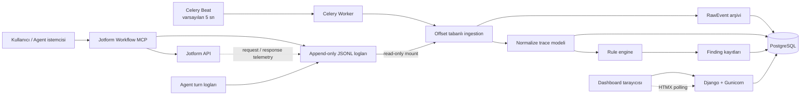

### Uygulamanın yaptığı ve yapmadığı şey

| Yapar | Yapmaz |
|---|---|
| JSONL loglarına yakın-gerçek-zamanlı read-side görünüm sağlar | MCP çağrılarının kritik yolunda proxy olmaz |
| Ham event’i koruyup normalize query modeli üretir | Jotform API çağrılarını kendisi çalıştırmaz |
| Request ve response’u `request_id` ile aynı kartta birleştirir | MCP protokolünde bulunmayan sohbet metnini tahmin etmez |
| Performans ve tekrar sorunlarını kural tabanlı bulur | Henüz dağıtık tracing backend’i veya OpenTelemetry collector değildir |
| PostgreSQL üzerinde kalıcı sorgu ve raporlama yapar | Redis’i uygulama sorgu cache’i olarak kullanmaz |

> **Redis hakkında kesin ayrım:** Mevcut kodda Redis, Celery broker’ı ve result backend’idir. Django `CACHES` ayarı yoktur; ekran sorguları doğrudan PostgreSQL’e gider.

---

## 2. Sistem sınırı ve temel kararlar

### 2.1 Neden sibling repository?

Dashboard, `jotform-workflow-mcp` ile aynı üst klasörde fakat ayrı repository/workspace olarak tutulur:

```text
jotform-mcp-phase1/
├── jotform-workflow-mcp/             # Çalışan MCP ürünü ve telemetri üreticisi
└── jotform-observability-dashboard/  # Bu read-side gözlem uygulaması
```

Bu sınırın sonuçları:

- MCP ürününün runtime bağımlılıkları dashboard’dan ayrıdır.
- Dashboard kapalı olsa bile MCP işlevi devam eder.
- Dashboard, sibling repo’yu Docker içinde `/data/mcp:ro` olarak görür.
- Gözlem sistemi MCP kaynak dosyalarını değiştiremez.
- Schema/adapter değişimleri kontrollü ve geriye uyumlu yapılabilir.

### 2.2 Mimari stil

Uygulama pratik bir **read-side projection** mimarisidir:

- **Event archive:** `RawEvent`, kaynağın mümkün olduğunca kayıpsız kopyasıdır.
- **Projection/query model:** Trace tabloları ekran sorgularına uygun normalize edilmiş yapılardır.
- **Derived insight:** Finding tabloları normalize modelden yeniden üretilebilir sonuçlardır.
- **Server-rendered UI:** Ayrı SPA ve frontend API orkestrasyonu yoktur.

Bu tam bir event-sourcing sistemi değildir. Normalized modeller event replay ile teorik olarak yeniden oluşturulabilir olsa da replay/reset komutu henüz ürünleştirilmemiştir.

### 2.3 Teknoloji seçimleri

| Alan | Teknoloji | Uygulamadaki görevi |
|---|---|---|
| Web/domain | Django 5.2 | URL routing, ORM, templates, admin, migrations |
| JSON API | Django REST Framework 3.16 | Üç salt-okunur JSON endpoint |
| Kalıcı veri | PostgreSQL 17 | Raw archive, traces, findings ve sorgular |
| Geliştirme fallback | SQLite | Docker olmadan lokal test/geliştirme |
| Kuyruk | Redis 7 | Celery broker ve result backend |
| Background job | Celery 5.5 | Periyodik ingestion task’ını çalıştırma |
| Scheduler | Celery Beat | Varsayılan 5 saniyelik ingestion tick’i |
| Web process | Gunicorn | Üç WSGI worker ile HTTP servisi |
| Static servis | WhiteNoise | Build sırasında toplanan CSS/static dosyaları |
| HTML | Django Templates | Server-side rendering |
| Canlı liste | HTMX | Session sonuç partial’ını 5 saniyede yenileme |
| Grafik | Apache ECharts | Aktivite, tool latency ve cost grafikleri |
| Markdown | Python-Markdown | Escape edilmiş agent yanıtını HTML’e çevirme |
| Container | Docker Compose | db, redis, web, worker, beat orkestrasyonu |

---

## 3. Katmanlı mimari

Kod bağımlılıkları aşağıdaki yönde akar:

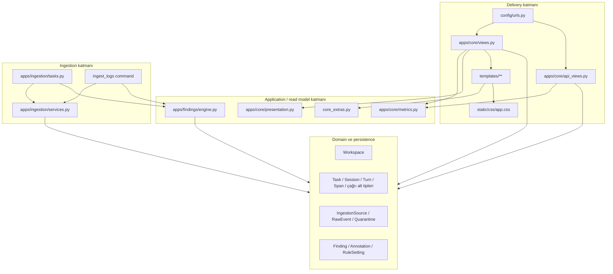

### 3.1 Bağımlılık kuralları

- Template’ler ORM sorgusu yapmaz; hazır context tüketir.
- Presentation helper’ları model verisini gösterim sözlüklerine çevirir; DB’ye yazmaz.
- Metrics fonksiyonları DB’den okur ve JSON-uyumlu sonuç üretir.
- Ingestion services hem raw hem normalize modellere transaction içinde yazar.
- Rule engine yalnız normalize trace modelini okur ve `Finding` üretir.
- View katmanı yalnız finding feedback POST işleminde yazma yapar.
- MCP log klasörüne hiçbir katman yazmaz.

---

## 4. Runtime ve deployment topolojisi

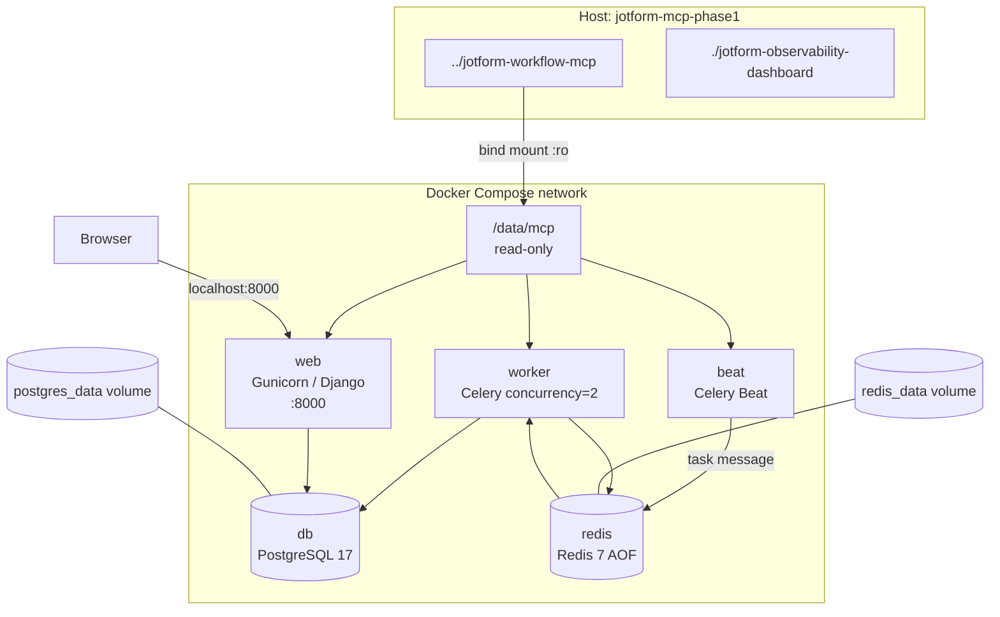

### 4.1 Servis sorumlulukları

| Servis | Process | Bağımlılık | Kalıcılık |
|---|---|---|---|
| `db` | PostgreSQL 17 | Yok | `postgres_data` named volume |
| `redis` | Redis 7, AOF açık | Yok | `redis_data` named volume |
| `web` | Gunicorn, 3 worker, 60 sn timeout | Sağlıklı db + redis | Stateless; DB’ye yazar yalnız finding feedback/migration |
| `worker` | Celery worker, concurrency 2 | Sağlıklı db + redis + web | Ingestion ve finding üretir |
| `beat` | Celery Beat | Sağlıklı db + redis + web | Her interval task planlar |

### 4.2 Healthcheck’ler

- PostgreSQL: `pg_isready -U observability -d observability`
- Redis: `redis-cli ping`
- Web: Python ile `/api/v1/overview/` endpoint’ine HTTP isteği
- Worker/Beat: Ayrı bir HTTP healthcheck tanımlı değildir; Compose process’in running durumunu ve bağımlılıkların health zincirini izler.

---

## 5. Domain terminolojisi ve trace hiyerarşisi

### 5.1 Kavramlar

| Kavram | Anlamı | Kimlik |
|---|---|---|
| Workspace | İzlenen ürün/ortam sınırı | UUID + benzersiz slug |
| Task | Üst düzey agent işi; nested task destekler | UUID + opsiyonel external task ID |
| Session | Bir konuşma veya MCP process aktivite grubu | UUID + workspace içinde external session ID |
| Turn | Bir kullanıcı sorusu ve agent yanıtı | Session içinde sequence number |
| Span | Zamanı ölçülen model/tool/HTTP/diğer operasyon | UUID + opsiyonel external span ID |
| ModelStep | Bir model span’inin token/stop ayrıntısı | Span ile one-to-one |
| ToolCall | Bir MCP tool span’inin argüman/sonuç ayrıntısı | Span ile one-to-one |
| ExternalCall | Bir Jotform HTTP span’inin endpoint/status/byte ayrıntısı | Span ile one-to-one |
| UsageRecord | Turn veya span kullanım/maliyet kaydı | BigAutoField |
| RawEvent | Kaynak JSONL satırının kayıpsız arşivi | Source + byte offset benzersiz |
| Finding | Kural motorunun ürettiği iyileştirme bulgusu | UUID + benzersiz fingerprint |

### 5.2 Mantıksal hiyerarşi

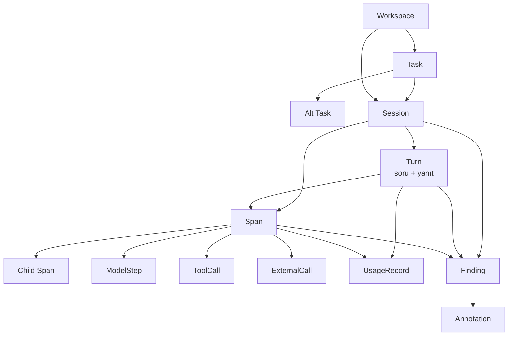

### 5.3 Örnek gerçek çalışma ağacı

```text
Session: 5986b551...
└── Turn 1: "Workflow'u güncelle"
    └── Model span: model step 1
        └── Tool span: get_workflow
            └── External span: GET /workflow/{id}
        └── Tool span: update_workflow
            ├── External span: PUT /workflow/{id}/updateTree
            └── External span: GET /workflow/{id}/combined
```

MCP istemcisi `turn_id`/sohbet metni göndermiyorsa hiyerarşi şu seviyede kalabilir:

```text
Session: process-level-session-id
├── Tool span
│   └── External span
├── Tool span
│   └── External span
└── ...
```

Bu durumda UI kaydı **MCP aktivitesi** olarak gösterir; sahte soru/yanıt üretmez.

---

## 6. Veri kaynakları

`discover_log_files()` şu adayları tarar:

| Öncelik | Yol | Beklenen içerik | Adapter |
|---:|---|---|---|
| 1 | `agent/logs/turns.jsonl` | Soru, yanıt, token, cost, embedded tool calls | `agent_turn` |
| 2 | `mcp_server/logs/mcp_audit.jsonl` | MCP tool ve Jotform request lifecycle event’leri | `mcp_audit` |
| 3 | `mcp_server/logs/sessions/*.jsonl` | Session bazlı MCP event dosyaları | `mcp_audit` |
| 4 | `mcp_server/revisions/*.jsonl` | Revision/audit artifact | `revision`; raw-only |
| Herhangi | Canonical event satırı | `schema_version` + `event_name` | `canonical_v1` |

Sadece gerçekten var olan dosyalar döndürülür. Dosya sırası deterministiktir; glob sonuçları `sorted()` ile sıralanır.

### 6.1 Format algılama önceliği

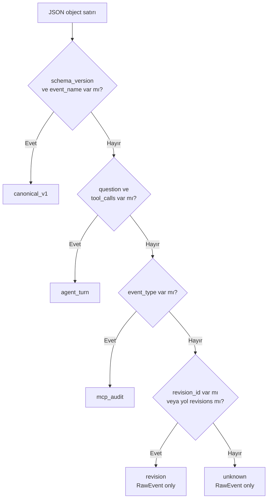

---

## 7. Ingestion akışı

### 7.1 Periyodik yakın-gerçek-zamanlı akış

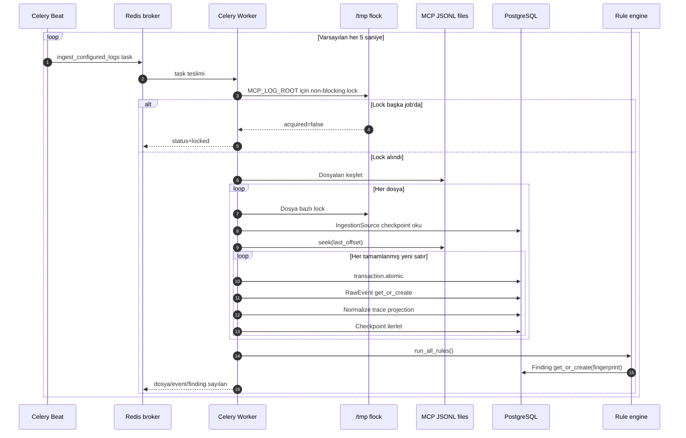

Bu bir WebSocket stream değildir. Gecikme yaklaşık olarak:

```text
event'in dosyaya yazılma anı
+ bir sonraki Beat tick'ine kadar 0..INGEST_INTERVAL_SECONDS
+ Worker queue bekleme süresi
+ yeni byte aralığını parse/normalize etme süresi
```

Normal yükte kullanıcı açısından “birkaç saniye içinde” görünür; kesin anlık teslim garantisi yoktur.

### 7.2 Dosya okuma state machine’i

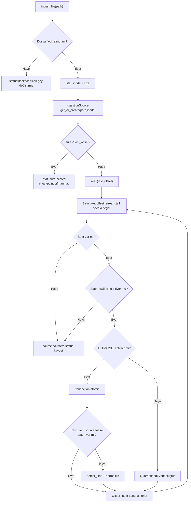

### 7.3 Checkpoint neden byte offset’tir?

`IngestionSource.last_offset`, “kaç satır okundu?” değil “dosyada hangi byte’a kadar güvenle işlendi?” bilgisidir.

Avantajları:

- Dosyanın tamamı her 5 saniyede tekrar parse edilmez.
- Değişken uzunlukta UTF-8 satırlarda doğru noktaya dönülür.
- Aynı satırın fiziksel konumu `RawEvent(source, source_offset)` kimliğine dönüşür.
- Büyük append-only loglarda maliyet toplam dosya boyutuyla değil yeni veri boyutuyla orantılıdır.

### 7.4 Eksik son satır güvenliği

Writer henüz satır sonu `\n` yazmadıysa reader satırı **işlemez ve checkpoint’i ilerletmez**. Bir sonraki tick aynı byte’tan tekrar başlar. Böylece yarım JSON yanlışlıkla karantinaya düşmez.

### 7.5 İki katmanlı idempotency

1. **Fiziksel idempotency:** `RawEvent(source_id, source_offset)` unique constraint.
2. **Semantic idempotency:** Finding için SHA-256 `fingerprint` unique constraint.

Normalization yalnız `RawEvent` ilk defa yaratıldığında çalışır. Aynı dosya yeniden okutulsa projection tekrar üretilmez.

### 7.6 Lock davranışı

- `ingestion_lock(path)` path’in SHA-256 özetinden `/tmp/jotform-observability-<24hex>.lock` üretir.
- `fcntl.LOCK_EX | LOCK_NB` ile process-level advisory lock alır.
- Celery task önce bütün root için, `ingest_file` ayrıca her dosya için lock alır.
- Root lock yavaş backfill sırasında sonraki Beat tick’lerinin aynı ağacı paralel işlemesini engeller.
- Lock alınamazsa hata değil `status=locked` sonucu döner.

### 7.7 Transaction sınırı

Her JSONL satırında `RawEvent` insert’i ve normalize projection aynı `transaction.atomic()` içindedir. Normalization başarısız olursa raw insert de rollback olur ve satır quarantine’a alınır. Böylece “raw var ama projection yarım” durumu normal hata yolunda oluşmaz.

### 7.8 OperationalError ayrımı

DB lock gibi `OperationalError`, bozuk input sayılmaz:

- Quarantine üretilmez.
- O satırdan önce checkpoint bırakılır.
- Sonraki ingestion run aynı satırı tekrar dener.

Diğer exception’lar input/parser sorunu sayılır ve quarantine’a yazılır.

### 7.9 Truncate/rotation politikası

Aynı inode’daki dosya `last_offset` değerinden küçük hale gelirse otomatik `0`’a dönülmez. Source `truncated` olur. Bu bilinçli olarak “yanlışlıkla duplicate projection üretme” yerine operatör müdahalesini seçer.

Yeni inode ile rotation yapılırsa `(path, inode)` farklı olduğu için yeni `IngestionSource` oluşturulur ve dosya baştan işlenebilir.

### 7.10 Quarantine

Parse/normalize hatasında saklananlar:

- kaynak ve byte offset,
- ilk 4000 karakterlik güvenli preview,
- exception class adı,
- exception mesajı,
- oluşturulma zamanı.

Dosyanın geri kalanı işlenmeye devam eder. Run sonunda en az bir quarantine varsa source durumu `error`, yoksa `healthy` olur.

Quarantine’a alınan satırdan sonra checkpoint satır sonuna ilerler. Yani aynı bozuk fiziksel satır her tick’te yeniden denenmez; hata kaydı bir kez tutulur ve sonraki satırlara devam edilir. Parser düzeltildikten sonra eski quarantine’ı otomatik replay eden bir komut şu an yoktur.

---

## 8. Adapter ve normalization davranışları

### 8.1 Ortak session çözümleme

`get_session(payload, provider=...)` şu external kimlik önceliğini kullanır:

```text
session_id -> run_id -> "unknown"
```

Session benzersizliği `(workspace, external_session_id)` üzerindedir. Aynı external session’a önce MCP event’i, sonra agent log’u gelirse iki session oluşmaz. Provider şu kuralla zenginleştirilir:

- Mevcut provider boş, `mcp` veya `canonical` ise gerçek agent provider’ı ile değişebilir.
- Mevcut gerçek provider daha sonra gelen `mcp` ile ezilmez.
- Model yalnız mevcut değer boşsa doldurulur.
- `trace_id` görüldüğünde correlation confidence `high` yapılır.
- `task_id` varsa Task get/create edilir ve Session’a bağlanır.

### 8.2 Agent turn adapter

Algoritma:

1. Payload provider’ıyla session çözülür.
2. Payload timestamp’i turn bitişi kabul edilir.
3. `started_at = timestamp - duration_ms` hesaplanır.
4. `sequence_no = session.turns.count() + 1` seçilir.
5. Soru, yanıt, token ve cost alanlarıyla Turn yaratılır.
6. Payload hem `trace_id` hem `turn_id` içeriyorsa daha önce normalize edilmiş spans, `attributes.turn_id` üzerinden bu Turn’a bağlanır.
7. Correlated payload’da embedded `tool_calls` tekrar normalize edilmez.
8. Correlation yoksa embedded tool call’lar yaklaşık ardışık zamanlarla Tool Span + ToolCall olarak üretilir.
9. `cost_usd` varsa ayrıca `UsageRecord` oluşturulur.
10. Session sınırları yeniden hesaplanır.

Legacy embedded tool timing’i gerçek concurrency bilgisi taşımaz; span attributes içinde:

```json
{
  "legacy_embedded": true,
  "timing_is_estimated": true
}
```

işaretleri bulunur.

### 8.3 MCP tool lifecycle adapter

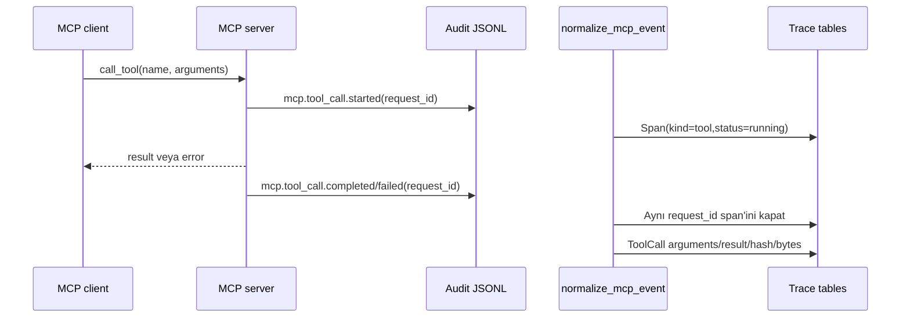

`started` event’i:

- `(session, request_id)` ile `Span.get_or_create` yapar.
- kind=`tool`, status=`running` olur.
- `trace_id`, `span_id`, `parent_span_id`, `turn_id` varsa kullanılır.
- arguments daha sonra span attributes içine yazılır.

`completed/failed` event’i:

- Aynı session içindeki `request_id + kind=tool` span’ini bulur.
- Started kaydı yoksa `missing_started_event=true` taşıyan recovery span’i oluşturur.
- Süre payload’dan, yoksa timestamp farkından hesaplanır.
- ToolCall sonucu JSON string ise parse edilir; parse edilemiyorsa `{"text": ...}` olur.
- `argument_hash`, `result_hash` ve UTF-8 `result_bytes` hesaplanır.

### 8.4 Jotform HTTP lifecycle adapter

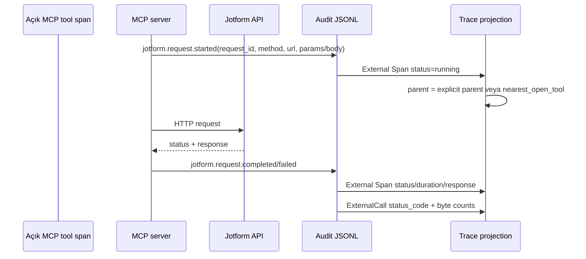

Parent seçimi:

1. Event `parent_span_id` taşıyorsa o external span ID aranır.
2. Yoksa timestamp’ten önce başlamış en yakın `running` tool span seçilir.
3. O da yoksa external span session altında parentsız kalır.

URL normalization, path segment’i tamamen numeric ve uzunluğu en az 5 ise `{id}` yapar:

```text
https://api.jotform.com/workflow/123456/combined
-> https://api.jotform.com/workflow/{id}/combined
```

Bu metrik cardinality’sini düşürür; gerçek URL `Span.attributes.url` içinde korunur.

Request byte sayısı şu stabilize edilmiş JSON’un UTF-8 uzunluğudur:

```text
stable_json({"params": params, "json_body": json_body}) byte uzunluğu
```

Response byte sayısı raw `response_text` UTF-8 uzunluğudur.

### 8.5 Model step adapter

- `model.step.started`, `external_span_id=span_id` ile running model Span oluşturur.
- Terminal event span’i kapatır; yoksa missing-start recovery span’i yaratır.
- `ModelStep.update_or_create` ile step number, stop reason, input/cached/reasoning/output token alanları yazılır.
- Explicit parent/turn correlation event’ten taşınır.

### 8.6 Canonical v1 adapter

Canonical event’te `event_name` son eki lifecycle phase’i belirler. Kind eşlemesi:

| Prefix | Span kind |
|---|---|
| `external.*` | `external` |
| `model.*` | `model` |
| `mcp.tool*` | `tool` |
| diğer | `other` |

Started event external span ID ile projection oluşturur; terminal event aynı projection’ı kapatır ve attributes’ı merge eder. Tool terminalinde `ToolCall`, model terminalinde `ModelStep` üretilir.

Mevcut sınırlama: canonical `external.*` event’leri External Span üretir fakat bu adapter henüz ayrıca `ExternalCall` one-to-one kaydı üretmez. Canonical turn association da MCP adapter kadar kapsamlı değildir.

### 8.7 Revision ve unknown adapter

`revision` ve `unknown` satırlar geçerliyse `RawEvent` olarak saklanır; `normalize()` bu türlerde projection üretmez. Bu, audit artifact’lerini kaybetmeden Session ekranını anlamsız revision kayıtlarıyla doldurmamayı sağlar.

---

## 9. Correlation mimarisi

Correlation, aynı kullanıcı işine ait agent, model, MCP tool ve HTTP olaylarını aynı ağaca bağlama işlemidir.

### 9.1 Kimliklerin anlamı

| Kimlik | Scope | Kullanıldığı yer |
|---|---|---|
| `workspace_id` | Ürün/ortam | Canonical contract; dashboard tek varsayılan Workspace üretir |
| `task_id` | Üst düzey agent işi | Task ve Session bağlantısı |
| `session_id` | Konuşma veya MCP process | Session unique key’in dış parçası |
| `turn_id` | Kullanıcı/agent mesaj çifti | MCP span’lerini Turn’a bağlama |
| `trace_id` | Uçtan uca çalışma zinciri | Span trace alanı ve high-confidence sinyali |
| `span_id` | Tek operasyon | Parent/child span graph |
| `parent_span_id` | Bir üst operasyon | Model → tool → HTTP ağacı |
| `request_id` | Started/terminal lifecycle çifti | Tool ve HTTP request-response eşleştirme |
| `sequence_no` | Kaynak içi sıra | Eşit timestamp’lerde deterministik ordering |

### 9.2 Güven seviyeleri

Mevcut kod iki ana seviye üretir:

- `high`: payload gerçek `trace_id` taşır.
- `low`: trace yoktur; session ID, zaman yakınlığı veya process-level bilgiyle bağlanmıştır.

`medium` veri modeli ve UI tarafından gösterilebilir fakat mevcut ingestion adapterları doğrudan `medium` üretmez.

### 9.3 Correlation karar ağacı

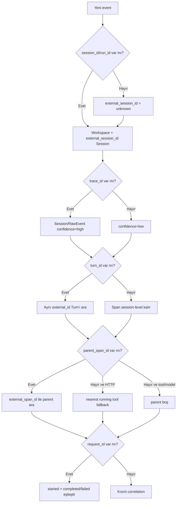

### 9.4 Request-response’un UI’da yeniden kurulması

Normalized `Span` ve subtype tabloları özet/metric için yeterlidir; eski kayıtların request veya response payload ayrıntısı yalnız `RawEvent.payload` içinde kalabilir. `SessionDetailView` bunu şu akışla tamamlar:

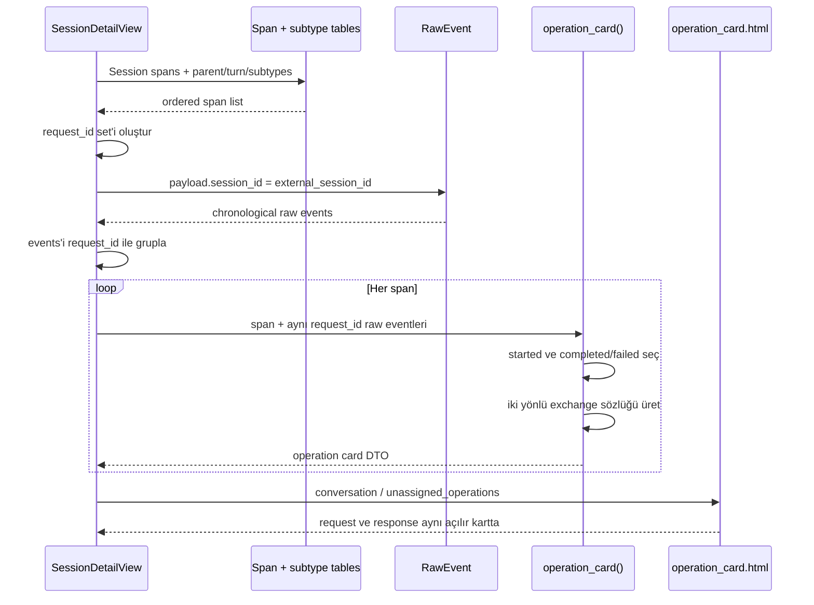

Sonuçta:

- Tool: `MCP client → MCP server` isteği + `MCP server → MCP client` yanıtı.
- HTTP: `MCP server → Jotform API` isteği + `Jotform API → MCP server` yanıtı.

Raw event bulunamazsa subtype/Span attributes fallback olarak kullanılır. Bu yüzden yeni ve eski kayıtlar aynı UI yapısında gösterilebilir.

### 9.5 Neden her sohbet otomatik ayrı Session değildir?

MCP server audit logger process-level bir `session_id` üretebilir. MCP protokolündeki tool çağrısı doğal olarak kullanıcı prompt’unu ve assistant cevabını taşımaz. Bu nedenle kesin sohbet ayrımı için istemci/agent’ın ortak `session_id`, `turn_id`, `trace_id` ve mümkünse soru/yanıt event’i üretmesi gerekir.

Dashboard’ın mevcut ilkesi:

- Kesin kimlik varsa birebir kullan.
- Kimlik yoksa activity’yi process-level session altında göster.
- Kullanıcı/assistant mesajı yoksa metin uydurma.

---

## 10. Veritabanı modeli

### 10.1 Entity relationship diyagramı

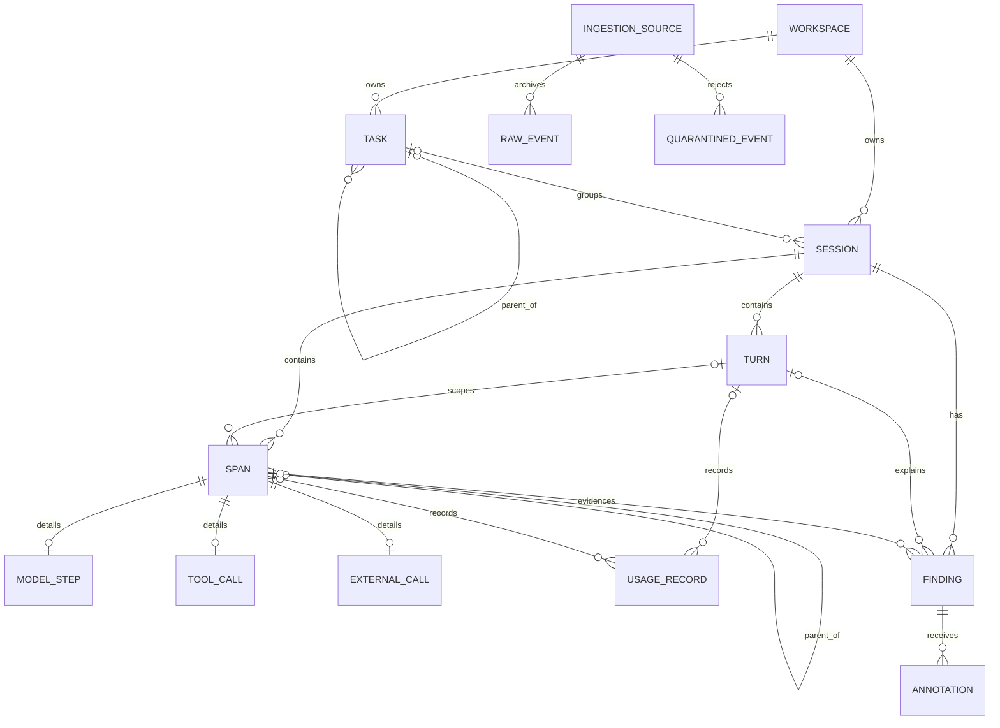

`RawEvent` ile `Session/Span` arasında bilinçli olarak foreign key yoktur. Raw payload farklı schema’lardan gelebilir; correlation JSON içindeki kimlikler üzerinden projection sırasında yapılır.

### 10.2 `core.Workspace`

| Alan | Tip | Anlam |
|---|---|---|
| `id` | UUID PK | Dahili workspace kimliği |
| `name` | Char(160), unique | Görünen ad |
| `slug` | Slug(160), unique | Stabil programatik kimlik |
| `environment` | Char(40) | development/staging/production gibi ortam |
| `timezone` | Char(64) | Workspace saat dilimi |
| `created_at` | auto datetime | Kayıt zamanı |

Ingestion `get_workspace()` ile `slug=jotform-workflow-mcp` kaydını lazy olarak üretir.

### 10.3 `traces.Task`

| Alan | Tip | Anlam |
|---|---|---|
| `id` | UUID PK | Dahili kimlik |
| `workspace` | FK Workspace, CASCADE | Sahip workspace |
| `parent` | self FK, SET_NULL | Nested task parent’ı |
| `external_id` | indexed Char(160) | Producer task ID |
| `name` | Char(500) | Genelde soru/iş adı |
| `kind` | Char(80) | Varsayılan `agent_request` |
| `status` | indexed Char(32) | running/ok/error vb. |
| `started_at`, `ended_at` | nullable datetime | Zaman sınırı |
| `tags` | JSON list | Genişletilebilir etiketler |

### 10.4 `traces.Session`

| Alan | Tip | Anlam |
|---|---|---|
| `id` | UUID PK | URL’de kullanılan dashboard ID |
| `workspace` | FK Workspace, CASCADE | Tenant/scope |
| `task` | nullable FK Task, SET_NULL | Üst iş |
| `external_session_id` | indexed Char(160) | Producer session/run kimliği |
| `provider` | indexed Char(80) | `mcp`, `anthropic`, `canonical` vb. |
| `model` | indexed Char(160) | Model adı |
| `agent_name` | Char(160) | Agent etiketi |
| `status` | indexed Char(32) | Türetilen overall durum |
| `correlation_confidence` | Char(16) | high/medium/low |
| `started_at`, `ended_at` | nullable datetime | Turn/span sınırlarından türetilir |
| `duration_ms` | nullable float | `ended_at - started_at` |
| `metadata` | JSON object | Gelecek genişletmeler |

Constraint: `(workspace, external_session_id)` unique.

Default ordering: `-started_at`. Sessions view ayrıca `ended_at DESC NULLS LAST`, sonra `started_at DESC NULLS LAST` kullanır.

`display_name`, external ID’nin ilk 12 karakteridir.

### 10.5 `traces.Turn`

| Alan | Tip | Anlam |
|---|---|---|
| `id` | UUID PK | Dahili turn kimliği |
| `session` | FK Session, CASCADE | Sahip session |
| `external_id` | Char(160) | Producer turn ID |
| `sequence_no` | PositiveInteger | Session içi sıra |
| `question` | Text | Kullanıcı mesajı |
| `answer` | Text | Agent/assistant mesajı |
| `status` | Char(32) | ok/error/unknown |
| `started_at`, `ended_at` | nullable datetime | Turn zamanı |
| `duration_ms` | nullable float | Turn süresi |
| `input_tokens`, `output_tokens` | nullable bigint | Token kullanımı |
| `cost_usd` | nullable decimal(14,6) | Biliniyorsa turn maliyeti |

Constraint: `(session, sequence_no)` unique. Default ordering `sequence_no`.

### 10.6 `traces.Span`

Span, model/tool/HTTP operasyonlarının ortak üst tablosudur.

| Alan | Tip | Anlam |
|---|---|---|
| `id` | UUID PK | Dashboard span kimliği |
| `session` | FK Session, CASCADE | Zorunlu scope |
| `turn` | nullable FK Turn, CASCADE | Varsa konuşma turn’ü |
| `parent` | nullable self FK, SET_NULL | Trace ağacı parent’ı |
| `trace_id` | indexed Char(64) | Uçtan uca trace kimliği |
| `external_span_id` | indexed Char(160) | Producer span kimliği |
| `request_id` | indexed Char(160) | Lifecycle pair kimliği |
| `kind` | indexed enum-like Char(24) | turn/model/tool/external/other |
| `name` | indexed Char(255) | Tool adı veya HTTP operation |
| `sequence_no` | PositiveInteger | Kaynak sırası |
| `started_at`, `ended_at` | nullable datetime | Operation sınırları |
| `duration_ms` | nullable float | Ölçülen veya hesaplanan süre |
| `status` | indexed Char(32) | running/ok/error vb. |
| `attributes` | JSON object | Adapter-specific metadata/fallback payload |

Indexler:

- `(turn, started_at)` konuşma içi timeline için.
- `(session, kind)` session içi tür sorguları için.

### 10.7 Span alt tipleri

#### `ModelStep`

| Alan | Tip | Anlam |
|---|---|---|
| `span` | OneToOne PK, CASCADE | Base model span |
| `step_no` | PositiveInteger | Model adımı |
| `stop_reason` | Char(80) | Bitiş nedeni |
| `input_tokens` | nullable bigint | Input token |
| `cached_tokens` | nullable bigint | Cache hit token |
| `reasoning_tokens` | nullable bigint | Reasoning token |
| `output_tokens` | nullable bigint | Output token |

#### `ToolCall`

| Alan | Tip | Anlam |
|---|---|---|
| `span` | OneToOne PK, CASCADE | Base tool span |
| `tool_name` | indexed Char(255) | MCP tool adı |
| `arguments` | JSON | Tool input |
| `result` | JSON | Tool output/error |
| `argument_hash` | indexed SHA-256 | Stable argument equality |
| `result_hash` | indexed SHA-256 | Stable result equality |
| `is_error` | indexed bool | Error metriği/rule input’u |
| `result_bytes` | PositiveBigInteger | Stable JSON UTF-8 boyutu |

#### `ExternalCall`

| Alan | Tip | Anlam |
|---|---|---|
| `span` | OneToOne PK, CASCADE | Base external span |
| `service` | indexed Char(100) | Varsayılan `jotform` |
| `method` | Char(16) | GET/POST/PUT... |
| `url_template` | indexed Char(500) | ID normalize endpoint |
| `status_code` | nullable indexed positive int | HTTP status |
| `request_bytes` | PositiveBigInteger | Yaklaşık request payload boyutu |
| `response_bytes` | PositiveBigInteger | Raw response text boyutu |

### 10.8 `traces.UsageRecord`

| Alan | Tip | Anlam |
|---|---|---|
| `id` | BigAutoField PK | Dahili kimlik |
| `span` | nullable FK Span, CASCADE | Span-scoped usage |
| `turn` | nullable FK Turn, CASCADE | Turn-scoped usage |
| `metric_type` | Char(64) | total/token/request gibi metrik türü |
| `quantity` | Decimal(18,6) | Miktar |
| `unit` | Char(32) | turn/token/request vb. |
| `cost_usd` | nullable Decimal(14,6) | Bilinen/hesaplanan maliyet |
| `pricing_version` | Char(80) | Fiyat kaynağı versiyonu |
| `estimated` | bool | Tahmin mi kesin mi |
| `recorded_at` | auto datetime | Kayıt zamanı |

Mevcut Cost ekranı `UsageRecord` yerine doğrudan `Turn.cost_usd` kullanır. `UsageRecord`, daha ayrıntılı/reprice edilebilir gelecekteki maliyet altyapısının zeminidir.

### 10.9 Ingestion tabloları

#### `IngestionSource`

| Alan | Anlam |
|---|---|
| `path` + `inode` | Birlikte benzersiz fiziksel kaynak kimliği |
| `kind` | auto/canonical_v1/agent_turn/mcp_audit/revision/unknown |
| `last_offset` | Son güvenli byte checkpoint |
| `last_hash` | Son yeni payload SHA-256 |
| `parser_version` | Şu an `1.0` |
| `status` | new/healthy/error/truncated |
| `last_seen_at` | Dosya en son ne zaman görüldü |
| `last_ingested_at` | Run ne zaman tamamlandı |
| `error_message` | Source-level son hata özeti |
| `records_ingested` | Kümülatif yeni raw event sayısı |

#### `RawEvent`

| Alan | Anlam |
|---|---|
| `source` + `source_offset` | Birlikte unique fiziksel event kimliği |
| `event_type` | event_name/event_type veya algılanan kind |
| `occurred_at` | Payload timestamp’i |
| `schema_version` | Yoksa 0 |
| `payload` | Tam JSON object |
| `payload_hash` | Stable JSON SHA-256 |
| `correlation_confidence` | trace_id varsa high, yoksa low |
| `ingested_at` | Dashboard’a giriş zamanı |

Index: `(event_type, occurred_at)`.

#### `QuarantinedEvent`

Source FK, source offset, raw preview, error type, error message ve created timestamp tutar.

### 10.10 Finding tabloları

#### `Finding`

| Alan | Anlam |
|---|---|
| `session` | Zorunlu owner |
| `turn`, `span` | Opsiyonel kanıt scope’u |
| `rule_code` | Kural kimliği |
| `severity` | high/medium/low |
| `confidence` | high/medium/low |
| `status` | open/accepted/false_positive/snoozed |
| `title`, `description`, `recommendation` | İnsan-okunur açıklama |
| `wasted_ms`, `wasted_usd` | Tahmini kayıp |
| `evidence` | Tool/count/hash/span ID gibi JSON kanıt |
| `fingerprint` | Benzersiz semantic idempotency hash’i |
| `created_at`, `updated_at` | Lifecycle zamanı |

#### `Annotation`

Finding feedback geçmişidir. Label, comment, opsiyonel Django user ve timestamp tutar. Finding silinirse annotations cascade silinir; kullanıcı silinirse `created_by` null olur.

#### `RuleSetting`

Kural kodu, enabled flag, default severity, JSON parameters, açıklama ve update timestamp tutar. Mevcut engine `enabled` alanını uygular; `severity` ve `parameters` henüz kuralların runtime hesabına bağlanmamıştır.

### 10.11 Cascade özeti

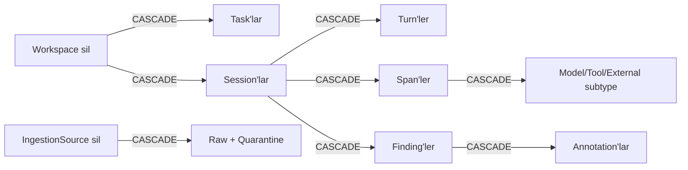

Task parent ve Session.task `SET_NULL`; Span.parent `SET_NULL`; Annotation.created_by `SET_NULL` kullanır.

---

## 11. Rule engine ve bulgu üretimi

### 11.1 Genel akış

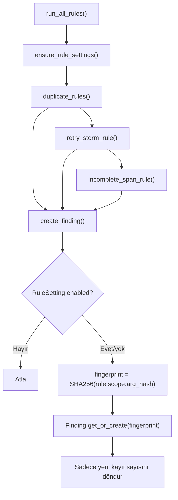

### 11.2 Scope

Duplicate ve retry kurallarında scope:

```text
span.turn_id varsa turn UUID
yoksa session UUID
```

Bu, aynı argümanlı tool çağrısının farklı turn’lerde normal olabilmesini; turn bilgisi olmayan MCP-only kayıtlarda ise session çapında değerlendirilmesini sağlar.

### 11.3 `REDUNDANT_READ` ve `DUPLICATE_EXACT_CALL`

Gruplama anahtarı:

```text
(scope, tool_name, argument_hash)
```

En az iki kayıt varsa finding çıkar. Tool şu read listesinde ise `REDUNDANT_READ`, değilse `DUPLICATE_EXACT_CALL`:

```text
list_workflows, get_workflow, list_step_types, get_step_schema,
get_form_fields, get_revisions, get_revision
```

Tahmini kayıp:

```text
wasted_ms = ikinci çağrıdan son çağrıya kadar span.duration_ms toplamı
```

Severity iki çağrıda `medium`, üç veya daha fazlada `high`; confidence `high`.

> İsim “arada write olmadan read” dese de mevcut implementasyon gerçek write invalidation analizi yapmaz; aynı scope/tool/argument hash tekrarını kullanır. Bu rapor kodun fiili davranışını esas alır.

### 11.4 `RETRY_STORM`

Sadece `ToolCall.is_error=True` kayıtları aynı `(scope, tool_name, argument_hash)` ile gruplanır.

Koşullar:

- En az 3 hata.
- Timestamp bulunan ilk ve son hata arası 2 dakikayı aşmamalı.

Tahmini kayıp ilk deneme hariç kalan hata sürelerinin toplamıdır. Severity/confidence `high`.

### 11.5 `INCOMPLETE_SPAN`

Koşul:

```text
Span.status == "running"
ve Span.started_at < now - 5 dakika
```

Fingerprint scope’u span UUID olduğu için her eksik span için tek finding oluşur. `wasted_ms=0`, severity `medium`, confidence `high`.

### 11.6 Finding feedback

Session detail POST akışı:

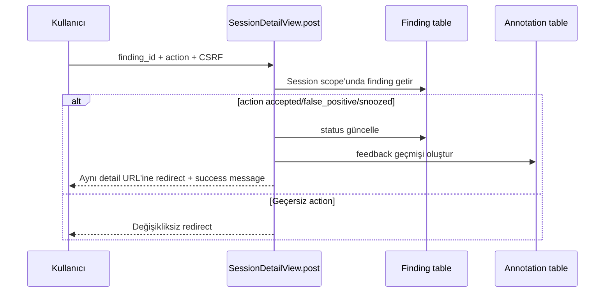

---

## 12. Metrikler ve bütün formüller

### 12.1 Percentile hesabı

`percentile(values, p)` null değerleri atar, float’a çevirip sıralar.

```text
index = (n - 1) * p
lower = floor(index)
upper = ceil(index)

lower == upper ise values[lower]
değilse:
values[lower] + (values[upper] - values[lower]) * (index - lower)
```

Bu nearest-rank değil, lineer interpolation’dır. p95 için `p=0.95`, p50 için `p=0.5`.

### 12.2 Overview metrikleri

| Context anahtarı | Formül / kaynak | Önemli nüans |
|---|---|---|
| `session_count` | `Session.objects.all().count()` | Aktivitesiz session varsa overview sayar; liste ekranı gizleyebilir |
| `success_rate` | `status=ok session / bütün session * 100` | Bir ondalığa yuvarlanır; session yoksa 0 |
| `p95_duration_ms` | Bütün non-null session duration üzerinde p95 | Null süreler percentile helper’da atılır |
| `total_cost_usd` | `Sum(Turn.cost_usd)`; null’lar hariç | Kayıt yoksa Decimal 0 |
| `open_findings` | `Finding.status=open` count | Severity ayrımı yok |
| `event_count` | Bütün RawEvent count | Normalize edilmeyen revision/unknown dahil |
| `quarantine_count` | Bütün QuarantinedEvent count | Overview template şu an bunu kartta göstermiyor |
| `cost_coverage` | cost’u non-null turn / bütün turn * 100 | Bir ondalığa yuvarlanır; turn yoksa 0 |

### 12.3 Session zaman serisi

`Session.started_at` gün bazında `TruncDate` ile gruplanır:

```sql
SELECT DATE(started_at) AS day, COUNT(id)
FROM session
WHERE started_at IS NOT NULL
GROUP BY day
ORDER BY day;
```

UI’ye `[{"day":"YYYY-MM-DD","count":N}]` olarak JSON verilir.

### 12.4 Session bounds ve status

Her normalization sonunda `update_session_bounds()`:

```text
started_at = min(en erken Turn.started_at, en erken Span.started_at)
ended_at   = max(en geç Turn.ended_at, en geç Span.ended_at)
duration   = (ended_at - started_at) milliseconds
```

Status önceliği:

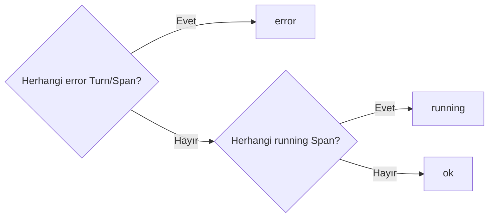

### 12.5 Tool Intelligence metrikleri

Her `tool_name` için Python tarafında ToolCall listesi gruplanır:

| Alan | Formül |
|---|---|
| `count` | ToolCall sayısı |
| `p50` | İlgili Span durations p50 |
| `p95` | İlgili Span durations p95 |
| `error_rate` | `is_error=True / count * 100`, bir ondalık |
| `avg_result_bytes` | `sum(result_bytes) / count`, en yakın integer |
| `findings` | Açık finding’lerde `span.name == tool_name` sayısı |

Sonuç çağrı sayısı azalan, ad artan sıradadır.

Performans notu: ToolCall kayıtları `select_related("span")` ile alınsa da aggregation DB’de değil Python memory’de yapılır.

### 12.6 Cost by model

Sadece `Turn.cost_usd IS NOT NULL` kayıtlar:

```text
GROUP BY session.provider, session.model
SUM(cost_usd), COUNT(turn)
ORDER BY cost DESC
```

Unknown fiyatlar `$0` sayılmaz; coverage üzerinden görünür.

### 12.7 Data Health metrikleri

| Metrik | Hesap |
|---|---|
| Raw events | `RawEvent.count()` |
| High correlation | `RawEvent.correlation_confidence=high` count |
| High correlation % | Template `widthratio(high_correlation, event_count, 100)` |
| Source quarantine | Her source için related QuarantinedEvent `Count` annotation |

### 12.8 Waterfall geometrisi

Session detail önce origin seçer:

```text
origin = session.started_at
      veya started_at'i olan ilk span
```

Ölçülen toplam:

```text
measured_total = max(
  span.ended_at varsa span.ended_at - origin,
  yoksa span.duration_ms veya 0
)

total = max(session.duration_ms veya measured_total veya 1, 1)
```

Her span için:

```text
offset_pct = max((span.started_at - origin) / total * 100, 0)
width_pct  = max((span.duration_ms veya 1) / total * 100, 0.35)
```

`0.35%` minimum, çok kısa span’in ekranda tamamen kaybolmasını önler. Bu yüzden piksel genişliği kesin süre oranından biraz büyük görünebilir.

---

## 13. URL, ekran, view, template ve veri kaynağı haritası

### 13.1 HTML route matrisi

| URL | URL adı | View | Template | Başlıca veri/hesap | Yazma? |
|---|---|---|---|---|---|
| `/` | `overview` | `OverviewView` | `dashboard/overview.html` | overview metrics, timeseries, 6 slow session, 6 top finding | Hayır |
| `/sessions/` | `session-list` | `SessionListView` | `sessions/list.html` veya HTMX `_results.html` | annotated Session query, filters, 25/page | Hayır |
| `/sessions/<uuid>/` GET | `session-detail` | `SessionDetailView` | `sessions/detail.html` | spans, conversation DTO, operations, waterfall, findings, raw events | Hayır |
| `/sessions/<uuid>/` POST | aynı | `SessionDetailView.post` | redirect | finding status + Annotation | Evet |
| `/tools/` | `tool-intelligence` | `ToolIntelligenceView` | `tools/overview.html` | tool_metrics, chart JSON | Hayır |
| `/findings/` | `findings` | `FindingsView` | `findings/list.html` | filtered findings, 30/page | Hayır |
| `/costs/` | `costs` | `CostView` | `costs/index.html` | cost_by_model + overview metrics | Hayır |
| `/data-health/` | `data-health` | `DataHealthView` | `data_health/index.html` | sources, quarantine, correlation counts | Hayır |
| `/admin/` | Django admin | Django Admin | Admin templates | Bütün registered modeller | Evet |

### 13.2 JSON route matrisi

| URL | APIView | Veri |
|---|---|---|
| `/api/v1/overview/` | `OverviewAPIView` | overview metrics + timeseries |
| `/api/v1/tools/` | `ToolsAPIView` | tool metrics listesi |
| `/api/v1/sessions/<uuid>/trace/` | `SessionTraceAPIView` | session özeti + ordered span listesi |

### 13.3 Ekran bağımlılık haritası

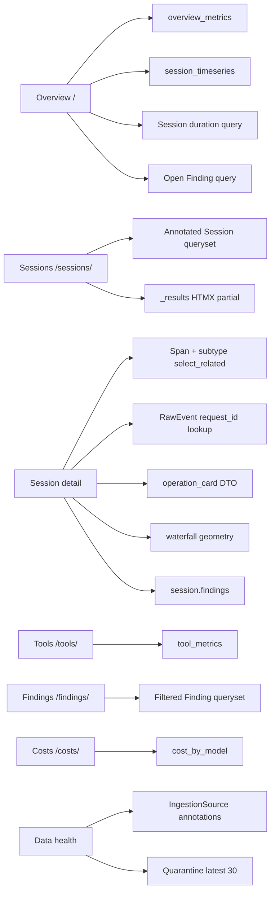

---

## 14. Ekranların ayrıntılı çalışma şekli

### 14.1 Ortak request lifecycle

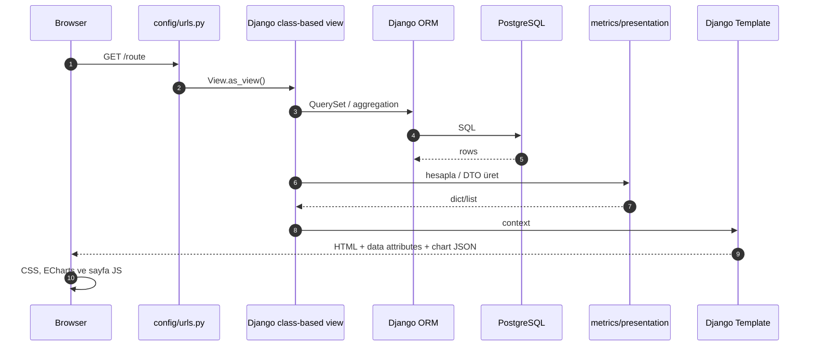

Base template bütün ekranlarda:

- sabit sidebar,
- workspace topbar,
- light/dark theme kontrolü,
- mobil navigation,
- flash message alanı,
- ortak CSS/ECharts/HTMX asset’leri

sağlar. View’ın verdiği `active_nav` değeri sidebar seçimini belirler.

### 14.2 Genel Bakış — `/`

#### View

`OverviewView`, `TemplateView` alt sınıfıdır ve şu context’i kurar:

| Context | Kaynak |
|---|---|
| `session_count`, `success_rate`, `p95_duration_ms`, `total_cost_usd`, `open_findings`, `event_count`, `quarantine_count`, `cost_coverage` | `overview_metrics()` |
| `timeseries_json` | `json.dumps(session_timeseries())` |
| `slow_sessions` | duration null olmayan Session’lar, `-duration_ms`, ilk 6 |
| `top_findings` | open Finding + Session join, `-severity`, `-created_at`, ilk 6 |
| `active_nav` | `overview` |

#### Template

`templates/dashboard/overview.html`:

1. Dört KPI kartı gösterir.
2. Günlük session aktivitesini line/area ECharts grafiğinde çizer.
3. İlk altı açık finding’i sağ panelde listeler.
4. İlk altı en yavaş session’ı tabloda gösterir.

Grafik server’dan hazır JSON array alır. Theme değişince CSS custom property’lerini tekrar okuyup chart option’ını yeniden uygular.

#### Önemli davranışlar

- `session_count` bütün Session tablosunu sayar; Sessions ekranının “aktivitesi olan kayıt” filtresini uygulamaz.
- `top_findings` severity’yi semantic rank ile değil string sırasıyla order eder. Gerçek “high önce” garantisi için gelecekte `Case/When` rank gerekir.
- `quarantine_count` context’e gelir ancak mevcut overview template’inde görünmez.
- Grafik yoksa boş canvas gösterir; özel empty-state henüz yoktur.

### 14.3 Session Explorer — `/sessions/`

#### Query kurulumu

Başlangıç queryset’i her Session’a şu annotation’ları ekler:

```text
turn_count    = distinct Turn count
span_count    = distinct Span count
tool_count    = distinct kind=tool Span count
finding_count = distinct Finding count
```

Sonra şu filtre uygulanır:

```text
turn_count > 0 OR span_count > 0
```

Bu sayede normalization tarafından yanlışlıkla/ara artifact olarak oluşabilecek aktivitesiz session kayıtları listede görünmez.

#### Desteklenen query parametreleri

| Parametre | Filtre |
|---|---|
| `q` | external session ID, model veya Turn.question `icontains` |
| `status` | exact Session.status |
| `provider` | exact provider |
| `model` | exact model |
| `correlation_confidence` | exact confidence |
| `tool` | related ToolCall.tool_name exact |
| `finding` | related Finding.rule_code exact |
| `page` | Paginator page |

Mevcut form doğrudan `q`, `status`, `provider`, `tool` alanlarını gösterir. Backend `model`, `correlation_confidence` ve `finding` parametrelerini de destekler; UI kontrolü henüz eklenmemiştir.

#### Sıralama ve pagination

```text
ended_at DESC NULLS LAST
started_at DESC NULLS LAST
page size = 25
```

Uzun süre açık kalıp yeni MCP event’i alan process-level session bu sayede yeni aktivitesiyle listenin üstüne gelebilir.

#### HTMX polling

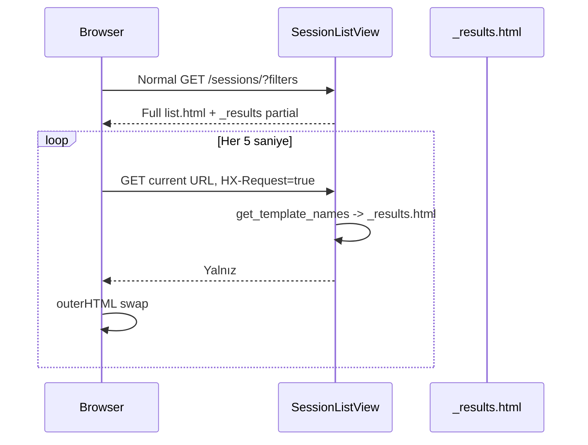

Filtreler current URL’de olduğu için HTMX polling onları korur. Pagination component’i ise link üretirken diğer query parametrelerini korumaz; filtreli listede sayfa değiştirirken filtre kaybı mevcut bir sınırdır.

#### Template ve responsive davranış

- `templates/sessions/list.html`: başlık ve GET form.
- `templates/sessions/_results.html`: canlılık şeridi, tablo/kartlar ve pagination.
- 620 px altında `<td data-label>` alanları CSS ile gerçek kart grid’ine dönüşür.
- Session türü `turn_count > 0` ise “Sohbet”, aksi halde “MCP aktivitesi”.
- Display ID ilk 12 karakterdir; link dahili UUID’ye gider.

### 14.4 Session Detail — `/sessions/<uuid>/`

Bu uygulamanın en yoğun ekranıdır. Aynı veriyi üç analiz katmanında gösterir:

1. Konuşma ve operation stream.
2. Waterfall/timeline.
3. Raw telemetry inspector.

#### Span query’si

```python
session.spans.select_related(
    "parent", "turn", "tool_call", "external_call", "model_step"
).order_by("started_at", "sequence_no")
```

Amaç operation kartı üretilirken subtype başına N+1 query oluşmasını önlemektir.

#### Context üretim akışı

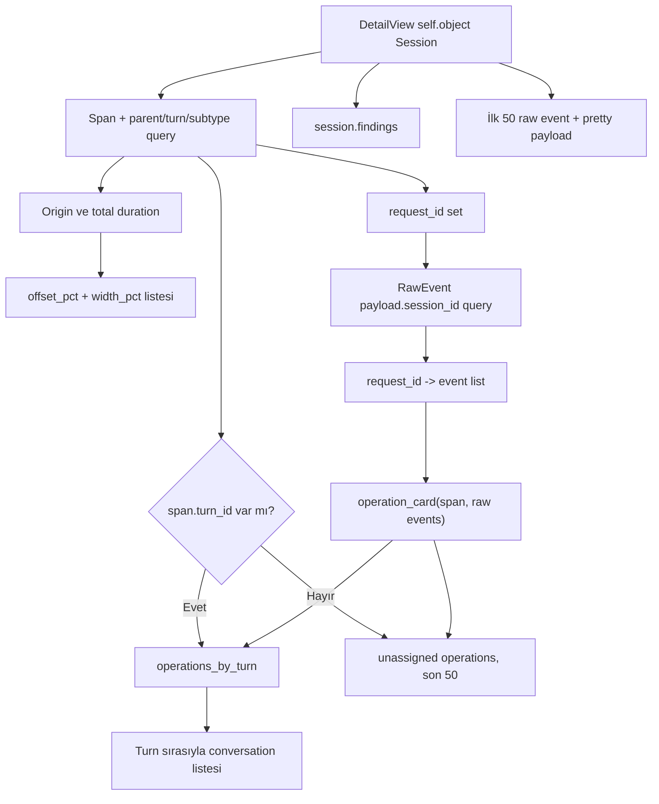

#### Conversation modu

Turn varsa her öğe:

```text
Turn divider
├── Kullanıcı mesajı
├── Agent çalışması
│   ├── model operation card
│   ├── MCP tool operation card
│   └── Jotform HTTP operation card
└── Assistant mesajı + token/cost footer
```

Assistant cevabı `conversation_markdown` filtresinden geçer. HTML önce escape edilir, sonra Markdown render edilir; böylece producer’dan gelen raw HTML çalıştırılmaz.

#### MCP-only modu

Turn yoksa son 50 parentsız/turn’süz operation gösterilir:

```python
[operation_card(span, ... ) for span in spans if not span.turn_id][-50:]
```

Bu “son 50” ordered span listesinin son 50 öğesidir. Başlık, istemcinin sohbet metni göndermediğini açıkça açıklar.

#### Operation filter ve aç/kapat

Template her kartta:

```html
data-operation-kind="tool|external|model|..."
data-operation-status="ok|error|running|..."
```

üretir. Sayfa sonundaki bağımlılıksız JavaScript:

- Tümü,
- MCP tool,
- Jotform API,
- Model,
- Hatalar

filtrelerini uygular. Bu işlem yeni HTTP isteği üretmez; sadece `.is-filtered` class’ını değiştirir. “Tümünü aç” yalnız görünür kartları açar, “Tümünü kapat” bütün kartları kapatır.

#### Operation DTO yapısı

`operation_card()` yaklaşık şu sözlüğü üretir:

```json
{
  "span": "Span instance",
  "kind": "tool",
  "title": "get_workflow",
  "label": "MCP TOOL",
  "summary": "4 alan döndü: ...",
  "fields": [{"name": "workflow id", "value": "42"}],
  "exchanges": [
    {
      "sender": "MCP client",
      "receiver": "MCP server",
      "label": "Giden tool isteği",
      "meta": "request-id",
      "fields": [],
      "raw": "..."
    }
  ],
  "raw_label": "Tool sonucu",
  "raw": "..."
}
```

#### Payload boyut limitleri

| Görünüm | Limit |
|---|---:|
| `pretty_payload()` default | 8000 karakter |
| Exchange raw payload | 4000 karakter |
| İnsan-okunur tek alan | 500 karakter |
| Result summary | yaklaşık 160 karakter |
| Operation payload field sayısı | 18 |
| Exchange field sayısı | 8 |

Limit aşılırsa kaç karakter/alan gizlendiği belirtilir. Bu limitler DB verisini kesmez; yalnız render DTO’sunu sınırlar.

#### Result summary önceliği

Dict sonuçta:

```text
error -> message -> hint -> title -> status -> non-empty key özeti -> boş başarılı yanıt
```

Listede öğe sayısı, primitive değerde kısa insan-okunur değer gösterilir.

#### Waterfall

Model mor, tool mavi, HTTP turkuaz, hata kırmızı bar ile gösterilir. Parent span varsa operation adı girintilenir. Bar yüzdeleri Bölüm 12.8’deki formülle üretilir.

#### Findings paneli

- Session’a bağlı findings newest-first gelir.
- `status=open` olan `<details>` başlangıçta açıktır.
- Açıklama, öneri ve wasted milliseconds gösterilir.
- “Kabul et” ve “Yanlış alarm” CSRF korumalı POST üretir.

Backend ayrıca `snoozed` action’ını destekler, mevcut detail template’inde snooze butonu yoktur.

#### Raw telemetry paneli

- Varsayılan kapalıdır.
- Session external ID’siyle eşleşen raw event’lerin **ilk 50** tanesi chronological gelir.
- Her payload `pretty_payload` ile formatlanır.
- Büyük session’larda bu “latest 50” değil “earliest 50” davranışıdır.

#### Canlılık sınırı

Sessions listesi HTMX ile yenilenir; açık Session Detail ekranı otomatik polling yapmaz. Yeni event geldiğinde detail için manuel refresh gerekir.

### 14.5 Tool Analizi — `/tools/`

`ToolIntelligenceView` bir defa `tool_metrics()` çağırır:

- Aynı liste tabloya `tool_metrics` olarak,
- ECharts’a `chart_json` olarak verilir.

Grafik:

- yatay turuncu bar: call count,
- mavi line: p95 ms,
- iki ayrı x-axis

kullanır. Tema değişiminde CSS token’larını yeniden okur. Tablo p50, p95, error rate, average result bytes ve open finding sayısını gösterir.

### 14.6 Bulgular — `/findings/`

`FindingsView` başlangıçta:

```python
Finding.objects.select_related("session", "span", "turn")
```

kullanır. Query parametreleri:

- exact `status`,
- exact `severity`,
- exact `rule` → `rule_code`.

Sonuç `-created_at` ile sıralanır ve 30/page paginate edilir. Kart session detail’e bağlanır; severity rail, rule code, confidence, status, description, recommendation ve wasted milliseconds gösterir.

Bu ekran salt okunurdur; feedback aksiyonları yalnız Session Detail içindedir.

### 14.7 Maliyet ve Kapasite — `/costs/`

`CostView`:

- `cost_by_model()` ile provider/model gruplarını,
- `overview_metrics()` ile total known cost ve coverage’ı

alır.

Donut chart yalnız cost’u bilinen model gruplarını içerir. Tablo provider, model, turn sayısı ve known cost gösterir. Turn cost’u yoksa “mevcut loglarda fiyat bilgisi yok” empty-state’i görünür.

Maliyet değeri `Decimal(14,6)` saklanır; chart JSON’a geçerken float’a çevrilir. Finansal kaynak-of-truth DB Decimal’dır, yalnız görselleştirme float kullanır.

### 14.8 Veri Sağlığı — `/data-health/`

`DataHealthView` context’i:

| Context | Query |
|---|---|
| `sources` | IngestionSource + related quarantine Count, `-last_seen_at` |
| `quarantined` | son 30 QuarantinedEvent + source join |
| `event_count` | bütün RawEvent count |
| `high_correlation` | confidence=high RawEvent count |

Ekran raw event ve high-confidence yüzdesi KPI’larını, source checkpoint tablosunu ve parser failure `<details>` listesini gösterir.

Source tablosundan operasyonel olarak şunlar okunabilir:

- hangi fiziksel dosya izlendi,
- hangi adapter algılandı,
- kaç byte’a gelindi,
- toplam kaç event alındı,
- quarantine var mı,
- son ingestion ne zaman.

### 14.9 Django Admin — `/admin/`

Register edilen modeller:

- Workspace,
- Task, Session, Turn, Span, ModelStep, ToolCall, ExternalCall, UsageRecord,
- IngestionSource, RawEvent, QuarantinedEvent,
- Finding, Annotation, RuleSetting.

Admin Django authentication gerektirir. Özel `ModelAdmin` column/filter tanımları yoktur; default admin görünümü kullanılır.

---

## 15. Sunum ve frontend mimarisi

### 15.1 Template composition

```mermaid
flowchart TD
    BASE["layouts/base.html"] --> OVERVIEW["dashboard/overview.html"]
    BASE --> SESSLIST["sessions/list.html"]
    SESSLIST --> RESULTS["sessions/_results.html"]
    BASE --> DETAIL["sessions/detail.html"]
    DETAIL --> OPCARD["components/operation_card.html"]
    DETAIL --> BADGE["components/status_badge.html"]
    RESULTS --> BADGE
    RESULTS --> PAG["components/pagination.html"]
    BASE --> TOOLS["tools/overview.html"]
    BASE --> FINDINGS["findings/list.html"]
    FINDINGS --> PAG
    BASE --> COSTS["costs/index.html"]
    BASE --> HEALTH["data_health/index.html"]
```

### 15.2 Neden ayrı frontend framework yok?

Dashboard’ın state’i ağırlıklı olarak server query sonucudur. Django Templates + küçük HTMX/JS parçaları:

- ayrı Node build pipeline’ını,
- client-side router’ı,
- aynı veri için ek serializer/API katmanını,
- hydration karmaşıklığını

gerektirmez. ECharts yalnız chart rendering, HTMX yalnız live partial update için kullanılır.

### 15.3 Design token’ları

`static/css/app.css` açık tema token’larını `:root`, koyu tema override’larını `:root[data-theme="dark"]` altında tanımlar.

Semantik renkler:

| Token/renk | Anlam |
|---|---|
| Jotform orange | Ana aksiyon, aktif nav, vurgu |
| Navy | Sidebar ve güçlü başlık |
| Blue | MCP tool operation |
| Aqua | Jotform HTTP/external operation |
| Purple | Model step |
| Green | healthy/ok/live |
| Red | error/high severity |
| Amber | running/medium severity |

Surface, line, shadow, radius ve sidebar genişliği de token’dır.

### 15.4 Tema akışı

```mermaid
sequenceDiagram
    participant HTML as HTML head inline script
    participant LS as localStorage
    participant CSS as app.css
    participant Toggle as Theme button
    participant Charts as ECharts instances

    HTML->>LS: pulse-theme oku
    LS-->>HTML: light/dark veya null
    HTML->>CSS: İlk paint öncesi html[data-theme]
    Toggle->>HTML: data-theme değiştir
    Toggle->>LS: tercihi kaydet
    Toggle->>Charts: pulse-theme-change event
    Charts->>CSS: CSS variable renklerini yeniden oku
    Charts->>Charts: option'ı yeniden çiz
```

### 15.5 Responsive kırılımlar

| Breakpoint | Davranış |
|---:|---|
| 1160 px | 4 KPI → 2 kolon; split/trace grid tek kolon; filtre grid küçülür |
| 820 px | Sidebar off-canvas; hamburger/scrim; content padding azalır |
| 620 px | KPI tek kolon; filtreler tek kolon; operation toolbar scroll; session tablo → kart |

Mobil sidebar Escape tuşuyla veya scrim/close butonuyla kapanır.

### 15.6 Erişilebilirlik

- `skip-link`, klavye ile doğrudan ana içeriğe geçer.
- `:focus-visible` bütün temel interaktif elemanlarda belirgindir.
- Icon-only butonlarda `aria-label` vardır.
- Sidebar `aria-controls` ve navigation label taşır.
- Operation filter butonları `aria-pressed` günceller.
- Dekoratif SVG’ler `aria-hidden=true` kullanır.
- Notice `role=status` taşır.

### 15.7 Markdown güvenliği

```mermaid
flowchart LR
    SOURCE["Turn.answer raw string"] --> ESCAPE["html.escape"]
    ESCAPE --> MD["markdown.markdown<br/>nl2br + sane_lists"]
    MD --> SAFE["mark_safe"]
    SAFE --> HTML["Template output"]
```

`mark_safe` tehlikeli görünse de ondan önce bütün source HTML escape edilir. Markdown tarafından üretilen izinli yapısal HTML güvenli kabul edilir.

### 15.8 Harici browser asset’leri

Base template runtime’da:

- Google Fonts,
- jsDelivr üzerinden ECharts,
- unpkg üzerinden HTMX

yükler. Offline veya CDN erişimi olmayan ortamda font fallback çalışır; ECharts/HTMX fonksiyonları çalışmayabilir. Production hardening’de asset vendoring ve CSP/SRI önerilir.

---

## 16. JSON API

### 16.1 Overview

`GET /api/v1/overview/`

```json
{
  "metrics": {
    "session_count": 35,
    "success_rate": 51.4,
    "p95_duration_ms": 8452953.0,
    "total_cost_usd": "0.000000",
    "open_findings": 62,
    "event_count": 3956,
    "quarantine_count": 0,
    "cost_coverage": 14.3
  },
  "timeseries": [
    {"day": "2026-08-14", "count": 8}
  ]
}
```

Decimal’ın JSON renderer’daki gösterimi DRF ayarına bağlı olarak string olabilir.

### 16.2 Tools

`GET /api/v1/tools/`

```json
{
  "results": [
    {
      "name": "get_workflow",
      "count": 10,
      "p50": 120.0,
      "p95": 450.0,
      "error_rate": 10.0,
      "findings": 2,
      "avg_result_bytes": 1240
    }
  ]
}
```

### 16.3 Session trace

`GET /api/v1/sessions/<uuid>/trace/`

Session summary ve ordered spans döner. Her span:

- id/parent_id/turn_id,
- kind/name/status,
- timestamps/duration,
- raw `attributes`

alanlarını içerir. ToolCall/ExternalCall subtype alanları ayrı serialize edilmez.

### 16.4 API sınırları

- DRF yalnız JSON renderer kullanır.
- Global pagination 50 tanımlıdır; bu APIView’lar pagination class’ını manuel kullanmadığı için response’lar paginate edilmez.
- Serializer class kullanılmaz; dict/list doğrudan oluşturulur.
- Default permission/authentication açıkça sınırlandırılmamıştır.
- Session lookup `Session.objects.get` kullanır; bulunamayan UUID için özel 404 dönüşümü tanımlı değildir.
- API version path’i `v1` olsa da canonical schema version’ından bağımsızdır.

---

## 17. Docker, Celery ve başlangıç akışları

### 17.1 `dashboard up`

```mermaid
sequenceDiagram
    participant User
    participant Script as ./dashboard
    participant Compose as Docker Compose
    participant DB as PostgreSQL
    participant Redis
    participant Web
    participant Worker
    participant Beat

    User->>Script: dashboard up
    Script->>Script: Docker ve compose kontrolü
    Script->>Script: .env yoksa .env.example kopyala
    Script->>Compose: up --detach --build --wait
    Compose->>DB: başlat + healthcheck
    Compose->>Redis: başlat + healthcheck
    DB-->>Compose: healthy
    Redis-->>Compose: healthy
    Compose->>Web: entrypoint RUN_MIGRATIONS=1
    Web->>DB: manage.py migrate --noinput
    Web->>Web: Gunicorn 3 worker
    Web-->>Compose: /api/v1/overview healthy
    Compose->>Worker: Celery worker
    Compose->>Beat: Celery beat
    Compose-->>Script: bütün servisler hazır
    Script-->>User: http://localhost:8000
```

### 17.2 Image build

Dockerfile adımları:

1. `python:3.12-slim` tabanı.
2. Bytecode kapatma ve unbuffered output.
3. `/app` workdir.
4. Sistem `app` user/group.
5. `requirements.txt` install.
6. Repository copy.
7. `collectstatic`.
8. `/app` ownership non-root user’a.
9. Runtime `USER app`.
10. Entry point ve varsayılan Gunicorn command.

### 17.3 Dashboard komutları

| Komut | Etki |
|---|---|
| `dashboard up` | Env hazırlar, build eder, detached başlatır, health bekler |
| `dashboard down` | Container/network’i kaldırır; named volume’ları korur |
| `dashboard restart` | Var olan servisleri restart eder; build yapmaz |
| `dashboard status` | `docker compose ps` |
| `dashboard logs` | web/worker/beat follow logs |
| `dashboard open` | URL’yi terminale yazar; browser açmaz |

`./dashboard` repository içinden aynı script’tir. PATH’e symlink kurulmuşsa yalnız `dashboard` yazılabilir.

### 17.4 Local development

```bash
python3 -m venv .venv
.venv/bin/pip install -r requirements.txt
.venv/bin/python manage.py migrate
.venv/bin/python manage.py ingest_logs
.venv/bin/python manage.py runserver
```

`DATABASE_URL` yoksa SQLite, `MCP_LOG_ROOT` yoksa dashboard’ın sibling `jotform-workflow-mcp` yolu kullanılır. Lokal Celery çalıştırılmıyorsa ingestion `manage.py ingest_logs` ile manuel yapılabilir.

### 17.5 Make hedefleri

| Hedef | Komut |
|---|---|
| `make install` | venv + requirements |
| `make migrate` | Django migrations |
| `make ingest` | Configured log tree ingestion |
| `make run` | Development server |
| `make test` | Django tests |
| `make check` | system check + migration drift |
| `make docker-up` | foreground Compose build/up |
| `make docker-down` | Compose down |

---

## 18. Konfigürasyon ve environment değişkenleri

| Değişken | Default | Kullanım |
|---|---|---|
| `DJANGO_SECRET_KEY` | development-only fallback | Django signing/crypto |
| `DJANGO_DEBUG` | `1` | Debug ve static storage seçimi |
| `DJANGO_ALLOWED_HOSTS` | localhost, 127.0.0.1, testserver | Host header allowlist |
| `DATABASE_URL` | yok → SQLite | PostgreSQL bağlantısı |
| `CELERY_BROKER_URL` | localhost Redis DB 0 | Task queue |
| `CELERY_RESULT_BACKEND` | localhost Redis DB 1 | Task result |
| `MCP_LOG_ROOT` | sibling repo | Log discovery root |
| `INGEST_INTERVAL_SECONDS` | `5` | Beat schedule interval |
| `RUN_MIGRATIONS` | `0` | Entrypoint migration gate; web Compose’ta `1` |

### 18.1 Database URL çözümleme

`urlparse` sonucu:

- path → DB name,
- username/password,
- hostname,
- port veya 5432,
- `CONN_MAX_AGE=60`

ile Django PostgreSQL config’ine çevrilir.

### 18.2 Django ayarları

- Dil: `tr-tr`
- Saat dilimi: `Europe/Istanbul`
- `USE_TZ=True`
- Static URL: `/static/`
- Production (`DEBUG=0`) static backend: `CompressedManifestStaticFilesStorage`
- REST renderer: yalnız JSON
- Global DRF page size: 50
- Celery timezone Django timezone ile aynı

---

## 19. Güvenlik, gizlilik ve veri sınırları

### 19.1 Mevcut korumalar

- MCP repository Docker mount’u `:ro`.
- Container root olmayan `app` kullanıcısıyla çalışır.
- Finding mutation formunda CSRF token vardır.
- Assistant Markdown render edilmeden önce HTML escape edilir.
- `.env`, SQLite, virtualenv ve collected static git dışında tutulur.
- Raw payload gösterimi varsayılan kapalı developer panelindedir.
- UI’daki büyük payload’lar render seviyesinde sınırlandırılır.
- Admin Django authentication kullanır.

### 19.2 Üretim öncesi açık riskler

- `.env.example` development credential’ları production için uygun değildir.
- `DJANGO_DEBUG` default `1`; production’da açıkça `0` olmalı.
- HTML dashboard route’larında login zorunluluğu yoktur.
- JSON API permission policy’si sınırlandırılmamıştır.
- Session detail finding POST’u CSRF korumalıdır fakat authenticated user zorunlu değildir.
- RawEvent payload potansiyel prompt, response, form verisi ve PII tutabilir.
- Dashboard katmanında merkezi recursive redaction yoktur; producer’ın redaction davranışına güvenir.
- CDN script/fontları için SRI/CSP tanımlı değildir.
- HTTPS ve reverse proxy bu Compose kapsamına dahil değildir.
- Retention/purge politikası yoktur; PostgreSQL büyümeye devam eder.
- Field-level encryption veya encrypted volume ayarı uygulama tarafından sağlanmaz.

### 19.3 Önerilen production güvenlik katmanı

```mermaid
flowchart LR
    INTERNET["Kullanıcı"] --> PROXY["TLS reverse proxy / SSO"]
    PROXY --> AUTH["Django auth + role permission"]
    AUTH --> WEB["Dashboard"]
    WEB --> REDACT["Ingestion-time recursive redaction"]
    REDACT --> PG[("Encrypted PostgreSQL storage")]
    PG --> RETENTION["Retention + purge jobs"]
    WEB --> AUDIT["Finding feedback audit"]
```

Production öncesi en az:

1. SSO/login zorunluluğu,
2. API permission,
3. secret rotation,
4. producer + ingestion redaction,
5. retention,
6. TLS,
7. database backup/restore testi

gereklidir.

---

## 20. Hata senaryoları ve operasyon rehberi

### 20.1 İlk teşhis ağacı

```mermaid
flowchart TD
    ISSUE["Dashboard sorunu"] --> LOAD{"localhost:8000 açılıyor mu?"}
    LOAD -->|Hayır| STATUS["dashboard status"]
    STATUS --> HEALTH{"web/db/redis healthy mi?"}
    HEALTH -->|Hayır| LOGS["dashboard logs"]
    HEALTH -->|Evet| PORT["Port/firewall/browser kontrolü"]

    LOAD -->|Evet| DATA{"Yeni veri görünüyor mu?"}
    DATA -->|Hayır| DHEALTH["/data-health/"]
    DHEALTH --> SOURCE{"Source var mı?"}
    SOURCE -->|Hayır| MOUNT["MCP_LOG_ROOT ve :ro mount"]
    SOURCE -->|Evet| SSTATUS{"healthy mi?"}
    SSTATUS -->|truncated| TRUNC["Rotation/inode/checkpoint müdahalesi"]
    SSTATUS -->|error| QUAR["Quarantine preview + parser"]
    SSTATUS -->|healthy| BEATQ["Beat/worker log ve offset artışı"]

    DATA -->|Evet| DETAIL{"Session detail eksik mi?"}
    DETAIL -->|Sohbet yok| CHAT["Producer turn_id + question/answer göndermiyor olabilir"]
    DETAIL -->|Operation yok| CORR["session_id/request_id correlation kontrolü"]
    DETAIL -->|Eski CSS| CACHE["Ctrl+Shift+R / static manifest"]
```

### 20.2 Dashboard açılmıyor

```bash
cd /home/avci/Desktop/jotform-mcp-phase1/jotform-observability-dashboard
./dashboard status
./dashboard logs
```

Kontrol sırası:

1. Docker daemon çalışıyor mu?
2. db ve redis healthy mi?
3. Web migration sırasında hata verdi mi?
4. Port 8000 başka process tarafından kullanılıyor mu?
5. `.env` içindeki DB/Redis hostname Compose servis adlarıyla eşleşiyor mu?

### 20.3 Dashboard boş

```bash
./dashboard status
docker compose exec web python manage.py ingest_logs
```

Sonra `/data-health/` ekranında:

- source path var mı,
- records ingested artıyor mu,
- offset dosya boyutuna yaklaşıyor mu,
- kind doğru mu,
- quarantine var mı

kontrol edilir.

### 20.4 Yeni Session oluşmuyor

Olası normal davranış: MCP server process-level aynı `session_id` ile yazmaya devam ediyordur. Bu durumda yeni satırlar yeni Session değil mevcut Session’ın yeni Span’leri olur ve liste `ended_at` güncellendiği için onu üste taşır.

Kesin chat/session ayrımı isteniyorsa producer her konuşmada yeni ortak `session_id` ve turn-level event üretmelidir.

### 20.5 Session’a tıklanınca sohbet görünmüyor

Session’da `Turn` yok, yalnız MCP tool/HTTP Span varsa bu veri eksikliği değil telemetri sınırıdır. Detail ekranı “MCP aktivite session’ı” açıklaması ve son 50 operation’ı göstermelidir.

Sohbet görünmesi için agent logunda en az:

- aynı `session_id`,
- `question`,
- `answer`,
- tercihen `turn_id` + `trace_id`

bulunmalıdır.

### 20.6 Source `truncated`

Dosya aynı inode ile checkpoint’ten küçük hale gelmiştir. Kod otomatik reset yapmaz. Önce log rotation politikasını kontrol edin. Güvenli recovery için source/checkpoint üzerinde bilinçli migration/management command gerekir; doğrudan production DB’de rastgele offset sıfırlamak duplicate projection riski taşır.

### 20.7 Quarantine artıyor

Data Health → Parser errors altında:

1. `error_type`,
2. `error_message`,
3. source path/offset,
4. raw preview

incelenir. Schema değiştiyse `detect_kind` ve ilgili normalize adapter güncellenir; `PARSER_VERSION` artırılması düşünülür.

### 20.8 Session sürekli `running`

En az bir Span terminal event almamıştır. Beş dakika sonra `INCOMPLETE_SPAN` finding’i çıkar. Producer crash/timeout sonrası `failed`/`abandoned` terminal event üretmeli veya recovery job eklenmelidir.

### 20.9 Cost coverage düşük

Bu, maliyetin sıfır olduğu anlamına gelmez. `Turn.cost_usd` çoğu logda null olabilir. Producer provider/model/pricing version ve token kullanımını güvenilir gönderirse cost pipeline genişletilebilir.

### 20.10 Session listesi yenileniyor, detail yenilenmiyor

Bu mevcut tasarımdır. `sessions/_results.html` HTMX polling taşır; detail sayfası polling içermez. Detail’i manuel yenileyin veya ileride ayrı detail partial/polling ekleyin.

### 20.11 Grafik görünmüyor ama tablo var

ECharts CDN erişimini ve browser console’u kontrol edin. Veri server-side tabloda görünüyorsa backend metriği çalışıyor, sorun çoğunlukla browser asset yüklemesidir.

### 20.12 Eski tasarım görünüyor

WhiteNoise/browser cache nedeniyle eski CSS tutulmuş olabilir. `Ctrl+Shift+R` yapın. Production manifest modunda image’ın son kaynakla yeniden build edildiğinden emin olun:

```bash
./dashboard up
```

### 20.13 Overlapping ingestion

Task sonucu `status=locked` ise başka run root lock’u tutuyordur; bu hata değildir. Uzun ilk backfill birden fazla Beat interval’ini aşabilir. Worker logunda aynı lock sürekli kalıyorsa process’in gerçekten çalışıp çalışmadığını inceleyin; `flock` process kapandığında OS tarafından bırakılır.

---

## 21. Performans karakteristiği ve bilinen sınırlar

### 21.1 İyi ölçeklenen kısımlar

- JSONL incremental byte offset; her tick bütün dosyayı okumaz.
- RawEvent source+offset unique constraint duplicate’i DB düzeyinde durdurur.
- Span `(session, kind)` ve `(turn, started_at)` indexleri temel detail sorgularını destekler.
- ToolCall `tool_name`, `argument_hash`, `is_error` indexleri rule/metric sorgularına yardımcıdır.
- Session detail subtype’larda `select_related` ile N+1’i azaltır.
- Finding fingerprint unique constraint rule rerun’ı güvenli kılar.
- Session listesi 25, Findings 30 kayıt paginate edilir.
- Raw inspector 50 event, MCP-only operation stream 50 card ile sınırlandırılır.

### 21.2 Büyüdükçe pahalılaşacak kısımlar

| Alan | Mevcut davranış | Ölçek riski |
|---|---|---|
| Overview p95 | Bütün Session duration değerlerini Python’a çeker | Büyük tabloda memory/CPU |
| Tool metrics | Bütün ToolCall + Span kayıtlarını Python’da gruplar | Her request O(total calls) |
| Finding rules | Bütün ToolCall’ları tekrar tarar | Her 5 sn büyüyen maliyet |
| Session bounds | Her event sonrası ilgili session Turn/Span min/max/existence query’leri | Yoğun tek session’da çok query |
| Detail raw pair | Session external ID’ye ait bütün RawEvent’leri okuyabilir | Process-level çok büyük session |
| Detail HTML | 50 operation’ın nested raw payload’ı HTML’e gömülür | Yüzlerce KB response |
| Data Health | Global counts ve source annotation | Çok büyük raw table’da count maliyeti |
| HTMX | Her açık browser 5 sn’de full filtered list query | Kullanıcı sayısıyla lineer yük |

### 21.3 Önerilen scale evrimi

```mermaid
flowchart LR
    MVP["Mevcut MVP"] --> A1["DB-native percentile/aggregate"]
    A1 --> A2["Incremental metric rollup tabloları"]
    A2 --> A3["Rule watermark / only-new-span evaluation"]
    A3 --> A4["Session detail server pagination/lazy payload"]
    A4 --> A5["Retention + partitioned RawEvent"]
    A5 --> A6["OpenTelemetry/ClickHouse gibi yüksek hacim backend"]
```

Öncelikli iyileştirmeler:

1. RawEvent’i zaman/source bazında partition veya retention.
2. Tool metrics için DB aggregation/materialized rollup.
3. Rule engine için son işlenen Span watermark’ı.
4. Raw payload’ı kart açıldığında endpoint’ten lazy load.
5. Detail operations için cursor pagination.
6. HTMX interval’ini visibility-aware yapmak veya push/SSE.

### 21.4 Bilinen model/logic sınırları

- Session uniqueness tek workspace + external ID; aynı external ID’nin gerçekten farklı run’larda reuse edilmesi birleşmeye yol açar.
- Agent turn sequence `count()+1`; farklı dosyaların eşzamanlı manuel ingestion’ında race potansiyeli vardır.
- Nearest-running-tool HTTP parent fallback zaman heuristic’idir.
- Canonical external span için ExternalCall subtype üretilmez.
- RuleSetting severity/parameters runtime kurallara tam bağlı değildir.
- “Redundant read” gerçek write invalidation kontrol etmez.
- Overview finding severity ordering lexicographic’tir.
- Detail raw event listesi earliest 50’dir; latest değil.
- API permission/404/serializer hardening eksiktir.
- Pagination linkleri mevcut filtre query parametrelerini taşımaz.
- Session detail live update değildir.
- Revision/unknown yalnız raw archive’da kalır.

---

## 22. Test mimarisi

### 22.1 Test katmanları

```mermaid
flowchart TD
    TESTS["Django TestCase suite"] --> ING["Ingestion integration tests"]
    TESTS --> VIEW["View/template/API tests"]
    ING --> TMP["Temporary real JSONL files"]
    ING --> DB["Test database projections"]
    ING --> RULE["Rule idempotency"]
    VIEW --> HTTP["Django test client"]
    VIEW --> HTML["Rendered HTML assertions"]
    VIEW --> JSON["API response assertions"]
```

### 22.2 `tests/test_ingestion.py` — 5 test

| Test | Kanıtladığı davranış |
|---|---|
| `test_agent_turn_is_idempotent_and_normalized` | Gerçek JSONL byte reader, ikinci run’da 0 yeni event, Session/Turn/ToolCall projection |
| `test_mcp_and_http_started_completed_events_are_paired` | Tool + HTTP lifecycle pairing, parent chain, URL template, duration ve response attribute |
| `test_invalid_json_goes_to_quarantine_without_raw_event` | Bozuk JSON quarantine olur, RawEvent olmaz |
| `test_duplicate_rule_is_stable_across_runs` | Rule fingerprint idempotency ve redundant read wasted time |
| `test_instrumented_agent_and_mcp_share_session_turn_and_parent_chain` | Canonical IDs ile tek Session/Turn, model → tool parent, trace bütünlüğü |

`write_jsonl` helper’ı temporary directory’de gerçekten byte-stream olarak okunan dosya üretir. Bu yüzden test yalnız saf normalize fonksiyonunu değil checkpoint reader’ı da kapsar.

### 22.3 `tests/test_views.py` — 11 test

| Test | Kanıtladığı davranış |
|---|---|
| `test_all_main_pages_render` | Yedi ana HTML route 200 döner |
| `test_trace_api_returns_session_shape` | Trace API session shape ve boş spans |
| `test_overview_and_tools_apis_render` | İki aggregate API 200 |
| `test_session_detail_renders_conversation_and_readable_tool_card` | Soru/Markdown cevap, operation filter attrs, tool request-response, readable fields |
| `test_base_layout_exposes_theme_and_mobile_navigation_controls` | Jotform Pulse brand, tema event’i, mobil menu hooks |
| `test_session_list_hides_empty_records_and_places_latest_activity_first` | Empty session gizleme ve ended_at öncelikli sıralama |
| `test_session_list_hx_request_returns_live_results_partial` | HX request yalnız partial ve 5 sn trigger döner |
| `test_mcp_only_session_shows_unassigned_tool_activity` | Turn yokken tool activity görünür |
| `test_session_detail_pairs_http_request_and_response_events` | RawEvent request_id ile çift yönlü HTTP kartı |
| `test_payload_presentation_is_human_readable_and_bounded` | Boolean/summary/truncation helper’ları |
| `test_conversation_markdown_escapes_raw_html` | XSS’e karşı escape + Markdown formatting |

Toplam: **16 test**.

### 22.4 Çalıştırma

```bash
.venv/bin/python manage.py check
.venv/bin/python manage.py test
.venv/bin/python manage.py makemigrations --check --dry-run
```

Docker health’i ayrıca:

```bash
./dashboard status
curl -f http://127.0.0.1:8000/api/v1/overview/
```

ile doğrulanabilir.

### 22.5 Henüz test edilmeyen önemli alanlar

- Multi-process ingestion race/lock entegrasyonu.
- Aynı inode truncate recovery operasyonu.
- Çok büyük dosya ve query performans testleri.
- Browser-level filter/theme/mobile interaction E2E testi.
- Finding feedback authentication/authorization.
- CDN offline fallback.
- PostgreSQL-specific JSON lookup ve migration restore testi.
- Canonical external/model/tool kombinasyonlarının tam matrisi.

---

## 23. Dosya dosya eksiksiz rehber

### 23.1 Repository ağacı

```text
jotform-observability-dashboard/
├── .dockerignore
├── .env.example
├── .gitignore
├── Dockerfile
├── Makefile
├── README.md
├── dashboard
├── docker-compose.yml
├── docker-entrypoint.sh
├── manage.py
├── requirements.txt
├── apps/
│   ├── core/
│   ├── traces/
│   ├── ingestion/
│   └── findings/
├── config/
├── contracts/
├── docs/
├── static/css/app.css
├── templates/
└── tests/
```

### 23.2 Kök dosyalar

#### `manage.py`

Django CLI bootstrap’ıdır. `DJANGO_SETTINGS_MODULE=config.settings` ayarlar ve migration, runserver, test, ingest gibi management command’ları Django’ya devreder. Domain logic içermez.

#### `requirements.txt`

Tam pinli runtime bağımlılıkları:

- Django,
- DRF,
- Celery,
- Redis Python client,
- Psycopg binary,
- Gunicorn,
- WhiteNoise,
- Markdown.

Node/frontend package manager bağımlılığı yoktur.

#### `.env.example`

Compose için development environment şablonudur. Gerçek `.env` source control dışında kalır. PostgreSQL hostname `db`, Redis hostname `redis`, MCP root `/data/mcp` olarak container network/mount ile uyumludur.

#### `.gitignore`

Secret, virtualenv, Python cache, SQLite DB, test/coverage output, collected static, media ve OS metadata’yı dışarıda tutar.

#### `.dockerignore`

Image build context’inden git, `.env`, venv, cache, local DB, pytest cache, `staticfiles` ve docs’u çıkarır. Sonuç: mimari Markdown dosyaları image içinde bulunmaz; kaynak repository’de tutulur.

#### `Dockerfile`

Tek-stage Python runtime image üretir. Dependencies install eder, source kopyalar, static toplar, non-root kullanıcıya geçer ve varsayılan Gunicorn command’ını tanımlar.

#### `docker-entrypoint.sh`

`RUN_MIGRATIONS=1` ise migration çalıştırır, sonra `exec "$@"` ile sinyalleri doğru alan asıl process’e geçer.

#### `docker-compose.yml`

Beş servis, iki named volume, health/dependency zinciri ve sibling MCP read-only bind mount’unu tanımlar. Web port 8000’i host’a açar; DB/Redis yalnız internal network’tedir.

#### `dashboard`

Kullanıcı-dostu Bash lifecycle wrapper’ıdır. Script directory’yi symlink-safe çözer, Docker/Compose varlığını kontrol eder, `.env` üretir ve `up/down/restart/status/logs/open` komutlarını yönetir.

#### `Makefile`

Lokal geliştirme ve temel Compose komutlarının kısa alias’larıdır. `check`, hem Django system check hem migration drift çalıştırır.

#### `README.md`

Hızlı başlangıç, Docker komutları, API listesi ve ayrıntılı doküman bağlantılarını taşıyan giriş belgesidir. Mimari source-of-truth olarak bu dosya değil `docs` raporları kullanılmalıdır.

### 23.3 `config/` package

#### `config/settings.py`

Merkezi Django/Celery konfigürasyonudur:

- env okuma,
- app ve middleware listeleri,
- templates,
- SQLite/PostgreSQL seçimi,
- locale/timezone,
- static/WhiteNoise,
- DRF JSON ayarları,
- Celery broker/result/schedule,
- MCP log root.

`database_config()` bu dosyadaki tek helper’dır.

#### `config/urls.py`

Bütün HTML/admin route’larını view class’larına bağlar; `/api/v1/` altını `apps.core.api_urls` içine include eder. URL mimarisinin ana girişidir.

#### `config/celery.py`

Celery app’i oluşturur, `CELERY_` namespace ayarlarını Django’dan yükler ve installed app task’larını autodiscover eder.

#### `config/asgi.py`

ASGI application entrypoint’idir. Mevcut deployment Gunicorn WSGI kullanır; ASGI dosyası gelecekte async server uyumluluğu sağlar.

#### `config/wsgi.py`

Gunicorn’un `config.wsgi:application` olarak yüklediği WSGI entrypoint’tir.

#### `config/__init__.py`

Celery app’i import/export eder; Django package yüklenirken Celery application’ın bulunmasını sağlar.

### 23.4 `apps/core/`

#### `apps/core/models.py`

Yalnız `Workspace` aggregate root’unu tanımlar. Workspace, traces tarafındaki Task/Session’ların tenant/ortam sınırıdır.

#### `apps/core/metrics.py`

Read-side metric fonksiyonları:

- `percentile`: lineer interpolated percentile,
- `overview_metrics`: KPI dict,
- `session_timeseries`: gün bazlı Session count,
- `tool_metrics`: tool grouping ve latency/error/result/finding metrikleri,
- `cost_by_model`: provider/model cost aggregation.

Bu modül DB’ye yazmaz.

#### `apps/core/views.py`

HTML ekranlarının application/read orchestration katmanıdır:

- `OverviewView`: KPI/chart/top listeler.
- `SessionListView`: annotations, filters, ordering, pagination, HTMX partial seçimi.
- `SessionDetailView`: feedback POST, span graph, raw pairing, conversation DTO, waterfall.
- `ToolIntelligenceView`: tool metrics.
- `FindingsView`: finding filters/pagination.
- `CostView`: cost aggregation.
- `DataHealthView`: source/quarantine/correlation health.

İş kurallarını template’e veya model method’larına dağıtmak yerine burada context olarak birleştirir.

#### `apps/core/presentation.py`

ORM modelini insan-okunur UI DTO’suna çevirir:

- JSON string parse,
- bounded pretty JSON,
- boolean/null/list/dict humanization,
- payload alan listesi,
- result summary,
- raw lifecycle phase bulma,
- exchange message üretme,
- tool/HTTP/model operation card üretme.

Request-response yön bilgisinin merkezi kaynağı bu dosyadır.

#### `apps/core/templatetags/core_extras.py`

`conversation_markdown` custom template filter’ını kaydeder. Raw HTML’i escape ettikten sonra `nl2br` ve `sane_lists` uzantılarıyla Markdown HTML üretir.

#### `apps/core/api_views.py`

Üç DRF `APIView` içerir: overview, tools ve session trace. Serializer yerine explicit dict üretir.

#### `apps/core/api_urls.py`

Üç JSON endpoint’in relative `/api/v1/` route tanımlarıdır.

#### `apps/core/admin.py`

Workspace modelini default Django admin’e kaydeder.

#### `apps/core/apps.py`

Core app’in `AppConfig` sınıfı ve default BigAutoField ayarı.

#### `apps/core/migrations/0001_initial.py`

Workspace tablosunun ilk schema migration’ıdır.

#### `apps/core/__init__.py`, `apps/core/migrations/__init__.py`, `apps/core/templatetags/__init__.py`

Python/Django package marker’larıdır; runtime logic içermez.

---

### 23.5 `apps/traces/`

#### `apps/traces/models.py`

Normalize trace query modelinin tamamıdır:

- `Task`: nested üst düzey işler,
- `Session`: konuşma/process activity aggregate’i,
- `Turn`: soru/yanıt,
- `Span`: ortak timed operation,
- `ModelStep`: model subtype,
- `ToolCall`: MCP subtype,
- `ExternalCall`: HTTP subtype,
- `UsageRecord`: kullanım/maliyet satırı.

Constraint, ordering ve indexlerin source-of-truth’u model `Meta` bloklarıdır.

#### `apps/traces/admin.py`

Sekiz trace modelini default Django admin’e register eder.

#### `apps/traces/apps.py`

Traces app config’i.

#### `apps/traces/migrations/0001_initial.py`

İlk Task/Session/Turn/Span/subtype/UsageRecord tablolarını, relation’ları, indexleri ve ilk unique constraint’leri oluşturur.

#### `apps/traces/migrations/0002_remove_session_unique_external_session_and_more.py`

Session unique constraint’ini `(workspace, external_session_id, provider)` yapısından `(workspace, external_session_id)` yapısına dönüştürür. Bu migration, aynı gerçek session’ın agent ve MCP provider etiketleriyle ikiye bölünmesini engelleyen önemli correlation değişikliğidir.

#### `apps/traces/__init__.py`, `apps/traces/migrations/__init__.py`

Package marker; logic yok.

### 23.6 `apps/ingestion/`

#### `apps/ingestion/models.py`

Read checkpoint ve raw archive modelidir:

- `IngestionSource`: fiziksel dosya state’i,
- `RawEvent`: başarılı JSONL satırı,
- `QuarantinedEvent`: parse/normalize failure.

RawEvent fiziksel idempotency constraint’i burada tanımlıdır.

#### `apps/ingestion/services.py`

Sistemin en yoğun write-side dosyasıdır. Fonksiyon sorumlulukları:

| Fonksiyon | Sorumluluk |
|---|---|
| `ingestion_lock` | Path hash’li non-blocking process lock |
| `stable_json` | Deterministik JSON serialization |
| `digest` | SHA-256 stable hash |
| `as_datetime` | ISO timestamp parse, naive ise UTC-aware |
| `json_value` | String JSON parse veya text wrapper |
| `get_workspace` | Varsayılan Workspace lazy create |
| `get_session` | Cross-provider Session/Task resolve ve enrich |
| `update_session_bounds` | Session start/end/duration/status türetme |
| `normalize_agent_turn` | Agent log → Turn/legacy ToolCall/UsageRecord |
| `url_template` | Uzun numeric path ID normalization |
| `nearest_open_tool` | HTTP için heuristic parent fallback |
| `normalize_mcp_event` | MCP tool, Jotform HTTP, model lifecycle projection |
| `normalize_canonical` | Canonical v1 span projection |
| `detect_kind` | Satır schema adapter seçimi |
| `normalize` | Adapter dispatcher |
| `ingest_file` | Dosya lock public wrapper |
| `_ingest_locked_file` | stat/checkpoint/read/transaction/quarantine core loop |
| `discover_log_files` | Configured source path discovery |
| `ingest_tree` | Bütün adayları sırayla ingest |

`PARSER_VERSION="1.0"` sabiti yeni source kayıtlarına yazılır.

#### `apps/ingestion/tasks.py`

Celery shared task `ingest_configured_logs`:

1. Bütün root için lock alır.
2. `ingest_tree(settings.MCP_LOG_ROOT)` çalıştırır.
3. `run_all_rules()` çalıştırır.
4. status/files/events/findings özet dict’i döndürür.

Root lock, Beat tick’lerinin parçalı/overlap ingest yapmasını engeller.

#### `apps/ingestion/management/commands/ingest_logs.py`

Manuel/backfill CLI’dır:

```bash
python manage.py ingest_logs
python manage.py ingest_logs /abs/a.jsonl /abs/b.jsonl
python manage.py ingest_logs --skip-findings
```

Path verilmezse configured root taranır. Her source sonucu stdout’a, yeni finding sayısı success output’a yazılır.

#### `apps/ingestion/admin.py`

Source, RawEvent ve QuarantinedEvent modellerini admin’e register eder.

#### `apps/ingestion/apps.py`

Ingestion app config’i.

#### `apps/ingestion/migrations/0001_initial.py`

Üç ingestion tablosu, source+inode ve source+offset constraint’leri ile event/time indexini oluşturur.

#### `apps/ingestion/management/__init__.py`, `apps/ingestion/management/commands/__init__.py`

Django custom management command discovery için package marker’lardır.

#### `apps/ingestion/__init__.py`, `apps/ingestion/migrations/__init__.py`

Package marker; logic yok.

### 23.7 `apps/findings/`

#### `apps/findings/models.py`

Rule output ve insan feedback domain’i:

- `Finding`: açıklama, öneri, loss, evidence, fingerprint,
- `Annotation`: status karar geçmişi,
- `RuleSetting`: enable/config metadata.

#### `apps/findings/engine.py`

Kural motorunun bütün saf/ORM logic’i:

- read tool set’i,
- rule açıklama registry’si,
- settings bootstrap,
- fingerprint,
- ortak idempotent create gate,
- duplicate/redundant,
- retry storm,
- incomplete span,
- aggregate runner.

#### `apps/findings/admin.py`

Finding, Annotation ve RuleSetting’i admin’e register eder.

#### `apps/findings/apps.py`

Findings app config’i.

#### `apps/findings/migrations/0001_initial.py`

RuleSetting, Finding ve Annotation tablolarını; auth user swappable dependency’siyle oluşturur.

#### `apps/findings/__init__.py`, `apps/findings/migrations/__init__.py`

Package marker; logic yok.

### 23.8 `apps/__init__.py`

Top-level application package marker’ıdır.

### 23.9 Templates

#### `templates/layouts/base.html`

Ortak HTML shell:

- document metadata,
- font/ECharts/HTMX include,
- first-paint theme restore,
- sidebar brand/navigation,
- mobile scrim/menu,
- topbar live state/theme toggle,
- Django messages,
- content/head/scripts blocks,
- theme/sidebar JavaScript.

#### `templates/dashboard/overview.html`

Overview page layout, dört KPI, activity chart, open findings ve slow sessions tablosu. ECharts option builder ve theme redraw script’i bu template’in `scripts` block’undadır.

#### `templates/sessions/list.html`

Session explorer başlığı, GET search/filter formu ve `_results.html` include’u.

#### `templates/sessions/_results.html`

HTMX self-polling root element, live strip, session table, empty state ve pagination. Mobil kartlar için her hücre `data-label` taşır.

#### `templates/sessions/detail.html`

Session detail’in bütün ana composition’ı:

- header/KPI strip,
- operation toolbar,
- conversation veya MCP-only stream,
- operation component include,
- waterfall,
- findings feedback forms,
- raw inspector,
- client-side operation filter/open/close script.

#### `templates/components/operation_card.html`

Reusable `<details>` operation component’i. Summary’de kind/title/summary/duration/status; detail’de exchanges, readable fields ve developer raw payload gösterir. `data-operation-kind/status` filter hook’ları burada üretilir.

#### `templates/components/status_badge.html`

Status string’ini `.status-<value>` CSS class’ına bağlayan iki satırlık reusable badge.

#### `templates/components/pagination.html`

Previous/current/next page navigation. Şu an yalnız `?page=N` üretir; diğer GET filtrelerini merge etmez.

#### `templates/tools/overview.html`

Tool bar+line chart, tema redraw script’i ve exact metrics table.

#### `templates/findings/list.html`

Finding filter formu, severity/recommendation/loss kart listesi ve pagination.

#### `templates/costs/index.html`

Known cost/coverage KPI’ları, donut chart, tema redraw ve model cost tablosu.

#### `templates/data_health/index.html`

Raw/correlation KPI’ları, source checkpoint tablosu ve quarantine detail listesi.

### 23.10 Static

#### `static/css/app.css`

Tek stylesheet yaklaşık şu bölümlerden oluşur:

1. Light/dark token’lar ve reset.
2. App shell, Jotform-inspired brand/sidebar/topbar.
3. Page headers, buttons, panels, metrics, grids.
4. Tables, filters, status/confidence/severity.
5. Overview ve session explorer.
6. Session header, conversation ve Markdown.
7. Operation/request-response/developer payload.
8. Waterfall/findings/raw inspector.
9. 1160/820/620 responsive kuralları.

CSS, component class sözleşmesinin source-of-truth’udur; template class adı değişirse burada karşılığı güncellenmelidir.

### 23.11 Contracts

#### `contracts/canonical-event-v1.schema.json`

JSON Schema draft 2020-12 canonical telemetry contract’ıdır. `additionalProperties=false` ile kontrollü top-level shape ister. Zorunlu alanlar:

```text
schema_version, event_id, workspace_id, session_id,
trace_id, span_id, sequence_no, event_name,
timestamp, status, attributes
```

`event_name` regex’i `.started|.completed|.failed` terminalini zorunlu kılar; status enum running/ok/error/cancelled/abandoned/unknown’dır.

#### `contracts/canonical-event-v1.example.jsonl`

Aynı MCP tool span için started/completed golden sample’dır. Contract adopter ve integration test yazarı için referanstır.

### 23.12 Tests

#### `tests/test_ingestion.py`

Temporary real JSONL input ile ingestion, normalization, correlation, quarantine ve finding idempotency integration testleri.

#### `tests/test_views.py`

Django test client ile HTML routes, API, ordering, HTMX, conversation, MCP-only, HTTP pairing, frontend hooks, humanization ve Markdown güvenliği testleri.

#### `tests/__init__.py`

Test package marker’ı.

### 23.13 Dokümantasyon

#### `docs/TEKNIK_RAPOR_TR.md`

İlk kapsamlı teknik teslim raporudur. Proje kararları, producer instrumentation geçmişi ve operasyon notları taşır.

#### `docs/MIMARI_AKIS_VE_KOD_REHBERI_TR.md`

Okuduğunuz bu belge; güncel ekran/view/query/formül akışlarını, Mermaid diyagramlarını ve dosya envanterini tek yerde birleştiren ana mimari rehberdir.

---

## 24. Bir değişiklik yapmak için nereye bakılır?

| İstenen değişiklik | Birincil dosya | Genellikle birlikte değişen dosyalar |
|---|---|---|
| Yeni ekran/route | `config/urls.py`, `apps/core/views.py` | yeni template, base nav, test |
| Overview KPI | `apps/core/metrics.py` | overview view/template, API test |
| Session filtre alanı | `SessionListView` | `sessions/list.html`, pagination/query tests |
| Session detail operation sunumu | `apps/core/presentation.py` | operation card template, CSS, view test |
| Yeni chart | İlgili view context + template script | metrics helper, CSS chart height |
| Yeni event formatı | `detect_kind` + normalize adapter | RawEvent schema/test/contract |
| Yeni MCP event alanı | `normalize_mcp_event` | Span/subtype model gerekirse migration, presentation/test |
| Correlation kuralı | `get_session` / adapter | model constraint, migration, ingestion test |
| Yeni span subtype | `apps/traces/models.py` | migration, ingestion, admin, API/presentation |
| Yeni finding kuralı | `apps/findings/engine.py` | RuleSetting, test, findings UI |
| Finding aksiyonu | `SessionDetailView.post` | detail form, Annotation/test |
| Cost hesabı | `metrics.cost_by_model` | Turn/UsageRecord ingestion, cost template/API |
| Data health göstergesi | `DataHealthView` | data health template, ingestion model |
| Tema/renk | `static/css/app.css` token’ları | ECharts template scripts |
| Mobil davranış | `static/css/app.css` media query | base/detail/list data hooks |
| JSON API alanı | `apps/core/api_views.py` | API test, consumer docs |
| Ingestion interval | `.env` `INGEST_INTERVAL_SECONDS` | Celery Beat restart |
| Yeni env ayarı | `config/settings.py` | `.env.example`, Compose, docs |
| Yeni container | `docker-compose.yml` | dashboard health/dependency docs |
| Static dependency vendoring | base template + static folder | Docker collectstatic, CSP |

### 24.1 Örnek: yeni event türü ekleme akışı

```mermaid
flowchart LR
    PRODUCER["Producer event contract"] --> DETECT["detect_kind"]
    DETECT --> ADAPTER["normalize_* adapter"]
    ADAPTER --> MODEL{"Yeni alan tablo mu<br/>attributes mı?"}
    MODEL -->|Tablo| MIG["Model + migration"]
    MODEL -->|Attributes| NO_MIG["JSON attribute"]
    MIG --> PRESENT["Presentation DTO"]
    NO_MIG --> PRESENT
    PRESENT --> TEMPLATE["Template/component"]
    TEMPLATE --> TEST["JSONL integration + view test"]
    TEST --> DOC["Contract + bu belge"]
```

### 24.2 Örnek: yeni metrik ekleme akışı

```mermaid
flowchart LR
    QUESTION["Metrik iş tanımı"] --> SOURCE["Source model/alan"]
    SOURCE --> FORMULA["metrics.py saf formül/query"]
    FORMULA --> CONTEXT["View context veya API"]
    CONTEXT --> UI["Template/chart/table"]
    UI --> EMPTY["Null/zero/empty davranışı"]
    EMPTY --> TEST["Formula + render test"]
```

---

## 25. Mimari invariant’lar

Bu maddeler sistemin korunması gereken temel doğrularıdır:

1. **MCP kritik yolu bağımsızdır.** Dashboard kapanınca MCP çağrısı bozulmamalıdır.
2. **MCP log mount’u salt okunurdur.** Dashboard producer dosyalarına yazmamalıdır.
3. **Raw önce, projection aynı transaction’dadır.** Bir satır yarım normalize edilmemelidir.
4. **Checkpoint yalnız tamamlanmış newline sonrası ilerler.** Yarım JSON kaybedilmemelidir.
5. **Aynı source+offset bir kez işlenir.** Fiziksel event idempotent olmalıdır.
6. **Aynı finding fingerprint bir kez oluşur.** Rule rerun duplicate üretmemelidir.
7. **Started ve terminal event request/span ID ile eşleşir.** Sadece zamana güvenilmez; zaman fallback’tir.
8. **Gerçek correlation ID heuristic’ten üstündür.** `trace_id`, `turn_id`, `parent_span_id` varsa kullanılmalıdır.
9. **Provider bilgisi geriye düşmez.** Agent provider’ı sonradan gelen generic MCP etiketiyle ezilmemelidir.
10. **Sohbet metni yoksa uydurulmaz.** UI MCP activity modunu açıkça söyler.
11. **Request ve response aynı operation altında gösterilir.** Ham JSON tek kullanıcı deneyimi olmamalıdır.
12. **Ham event projection’dan bağımsız korunur.** Yeni adapter/backfill olasılığı açık kalmalıdır.
13. **Unknown cost sıfır değildir.** Coverage ile ayrı ifade edilmelidir.
14. **Running span terminal event gelene kadar running kalır.** Sessizce ok yapılmamalıdır.
15. **Büyük payload UI’da bounded’dır, DB’de keyfi kesilmez.** Sunum limiti veri kaybı değildir.
16. **Markdown önce escape edilir.** Producer HTML’i doğrudan güvenilir kabul edilmez.
17. **Frontend filtreleri domain verisini değiştirmez.** Yalnız görünürlüğü yönetir.
18. **Tema tercihi kullanıcıya aittir ve kalıcıdır.** Grafikler de temayla yeniden çizilir.
19. **Schema değişikliği migration ile yapılır.** Model dosyası tek başına değiştirilmez.
20. **Dokümantasyon kodla birlikte güncellenir.** Yeni route/model/event/rule bu rehbere işlenmelidir.

### Son mimari özet

```mermaid
flowchart TB
    PRODUCER["Jotform MCP + Agent"] -->|"append JSONL"| ARCHIVE["RawEvent archive"]
    ARCHIVE -->|"normalize"| SESSION["Session / Turn / Span graph"]
    SESSION --> SUBTYPES["ModelStep / ToolCall / ExternalCall"]
    SUBTYPES --> METRICS["Metrics"]
    SUBTYPES --> RULES["Rules"]
    RULES --> FINDINGS["Findings + feedback"]
    SESSION --> PRESENT["Presentation DTO"]
    ARCHIVE --> PRESENT
    METRICS --> VIEWS["Django views + APIs"]
    FINDINGS --> VIEWS
    PRESENT --> VIEWS
    VIEWS --> UI["Jotform Pulse UI"]
```

Bu zincirde `RawEvent` denetlenebilir gerçeklik, trace tabloları sorgulanabilir gerçeklik, metrics/findings türetilmiş yorum, UI ise insan-okunur sunum katmanıdır.
